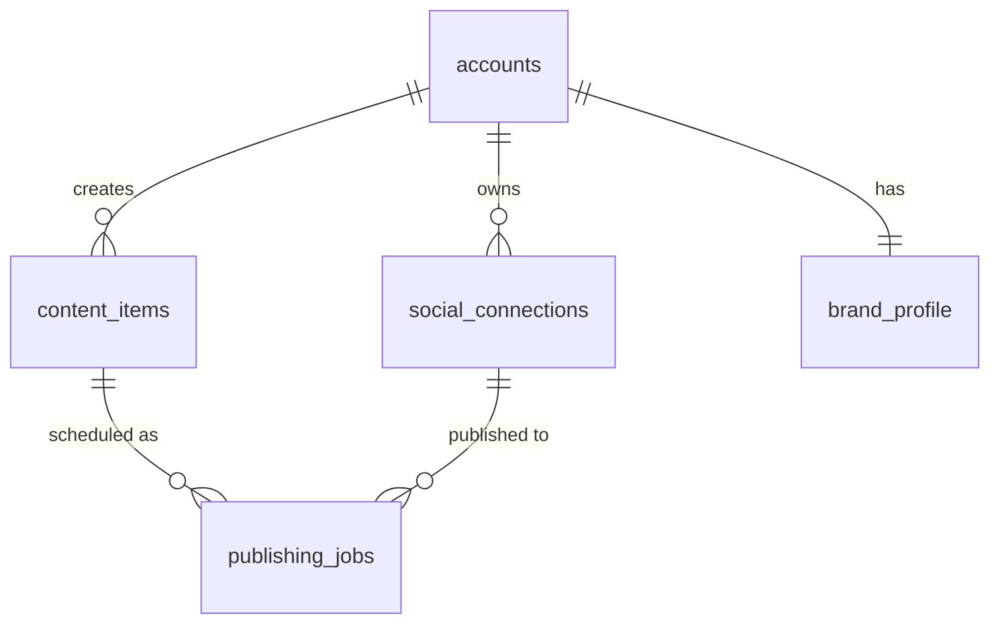
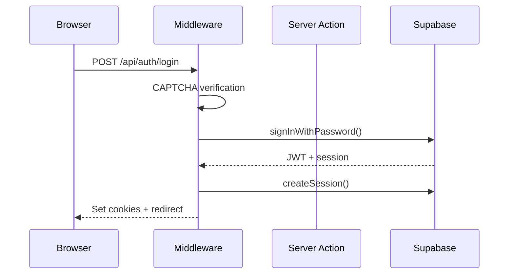

# Obsidian Documentation Vault — Living Project Documentation

## What This Skill Does

This skill maintains an `Obsidian/` folder at the root of each project as a **living documentation vault**. The vault serves four purposes:

1. **Reference** — Always-current documentation of architecture, features, schema, and APIs that Claude and humans can consult
2. **Communication** — A two-way channel where the user edits docs to express intent (via `#change-request` tags) and Claude reads them as work instructions
3. **Validation** — Drift detection that warns when code and documentation have diverged
4. **Optimization** — Active code quality analysis that flags performance issues, architectural smells, and tech debt as Claude discovers them during documentation

The vault uses Obsidian-flavored markdown with `[[wikilinks]]` for cross-referencing, YAML frontmatter for metadata, tags for workflow signals, and **Mermaid diagrams** for visual architecture maps (Obsidian renders these natively — use them liberally).

---

## Core Workflow

Every time this skill is invoked, follow this decision tree:

### 1. Does the project have an `Obsidian/` folder?

**No** → Run the **Initialize** workflow (see below).
**Yes** → Continue to step 2.

### 2. What triggered this invocation?

| Trigger | Action |
|---------|--------|
| User asked to create/initialize docs | Run **Initialize** |
| User asked to update/sync docs | Run **Sync** |
| You just finished making code changes | Run **Sync** (update only the docs affected by your changes) |
| User mentions change requests or you see `#change-request` tags | Run **Process Change Requests** |
| User asks about project structure/architecture | **Read** the vault and answer from it |
| User asks to check if docs are current | Run **Drift Detection** |
| User asks to document a specific feature/area | Run **Document Section** |
| User asks about optimizations, improvements, or tech debt | Run **Health Audit** and update `Health/` docs |

---

## Initialize Workflow

Create the vault from scratch by scanning the entire project. This is the most intensive operation — it reads the codebase and generates comprehensive documentation. **Use parallel agents to speed this up significantly.**

### Vault Structure

```
Obsidian/
├── _Index.md                         # Master dashboard — map of contents (MOC)
├── Architecture/
│   ├── _Architecture MOC.md          # Section hub with Dataview queries
│   ├── Overview.md                   # Stack, deployment, key decisions
│   ├── Data Flow.md                  # How data moves (with Mermaid diagrams)
│   ├── Route Map.md                  # All pages/routes with navigation flow
│   └── Auth & Security.md           # Auth model, RBAC, middleware
├── Features/
│   ├── _Features MOC.md              # Section hub — auto-lists all features
│   └── [Feature Name].md            # One file per feature/module
├── Database/
│   ├── _Database MOC.md              # Section hub with schema overview
│   ├── Schema.md                     # Tables, columns, types (with ER diagram)
│   ├── RLS Policies.md              # Row-level security documentation
│   └── Migrations.md                # Migration history and notes
├── API/
│   ├── _API MOC.md                   # Section hub — all endpoints at a glance
│   ├── Server Actions.md            # All server actions with signatures
│   ├── Route Handlers.md            # API routes with methods and auth
│   └── External Integrations.md     # Third-party APIs and contracts
├── Components/
│   ├── _Components MOC.md            # Section hub with component tree
│   └── Component Index.md           # UI component catalog with dependency map
├── Business Rules/
│   ├── _Business Rules MOC.md        # Section hub — domain rules index
│   └── [Domain Area].md             # One file per domain (e.g., Bookings, Deposits, Pricing)
├── Health/
│   ├── _Health MOC.md                # Section hub with audit summary
│   ├── Optimization Opportunities.md # Performance issues, architectural smells
│   └── Tech Debt.md                  # Tracked debt items, prioritized
├── Change Log/
│   └── [YYYY-MM-DD].md             # Auto-generated change entries
└── Change Requests/
    └── _Active.md                    # Collected change requests for processing
```

### Step 1: Quick scan & create folder structure

Before launching agents, the **orchestrator** (you) does a fast scan to understand the project shape:

1. Read `CLAUDE.md`, `package.json`, `.env.example` — get the project overview
2. Run `ls` on `src/app/` to identify all routes and features
3. Run `ls` on `supabase/migrations/` to confirm DB presence
4. Create the empty `Obsidian/` directory structure (all folders and subfolders)

This takes ~30 seconds and gives you the context needed to brief the agents.

### Step 2: Launch parallel specialist agents

Deploy **6 agents in parallel**, each responsible for one vault section. Launch them all in a **single message** using the Agent tool so they run concurrently. Each agent receives the project root path, the vault path, and a focused brief.

**CRITICAL**: Every agent prompt must include:
- The project root path and vault output path
- Instructions to read `references/templates.md` from the skill for formatting standards
- Instructions to use structured frontmatter tags, breadcrumb navigation, callout blocks, and Mermaid diagrams
- Instructions to write files directly to the `Obsidian/` directory
- A reminder to record any health findings (optimization opportunities, tech debt) in a structured format that the Health agent can collect

Here are the 6 agents to launch simultaneously:

#### Agent 1: Architecture

```
Scan the project and generate all files in Obsidian/Architecture/:
- _Architecture MOC.md — Section hub with Dataview query and overview diagram
- Overview.md — Tech stack, project structure, key dependencies, env vars, architectural decisions
- Data Flow.md — Request lifecycle and data mutation patterns with sequenceDiagram and graph TD
- Route Map.md — All routes from src/app/ with navigation flow diagram (graph LR), grouped by auth level
- Auth & Security.md — Middleware pipeline, sign-in flow, RBAC table, security headers (with sequenceDiagram and graph LR)

Read: CLAUDE.md, package.json, .env.example, middleware.ts, src/app/ directory structure, src/lib/supabase/, src/lib/auth/
```

#### Agent 2: Database

```
Scan the database layer and generate all files in Obsidian/Database/:
- _Database MOC.md — Section hub with Dataview query
- Schema.md — All tables with columns, types, relationships, indexes, and a full erDiagram
- RLS Policies.md — Document all RLS policies per table
- Migrations.md — Migration history with dates and descriptions

Read: supabase/migrations/*.sql, supabase/schema.sql, src/types/database.ts, src/lib/utils (for fromDb mapping)
```

#### Agent 3: API & Integrations

```
Scan all server actions and API routes, generate files in Obsidian/API/:
- _API MOC.md — Section hub with Dataview query
- Server Actions.md — Every server action with file, auth requirements, params, return type, side effects
- Route Handlers.md — Every API route handler with method, auth, purpose
- External Integrations.md — All third-party API integrations with dependency map (graph LR)

Read: src/app/actions/ (or src/actions/), src/app/api/, src/lib/ (for integration clients)
```

#### Agent 4: Features & Business Rules

```
Identify all distinct features/modules and generate:
- Obsidian/Features/_Features MOC.md — Section hub with feature map diagram
- Obsidian/Features/[Feature Name].md — One file per feature with purpose, user flow diagram, key files, data model, permissions, edge cases
- Obsidian/Business Rules/_Business Rules MOC.md — Section hub
- Obsidian/Business Rules/[Domain].md — One file per domain area with rules, lifecycle state diagrams, validation rules

Read: src/app/ (page.tsx files for features), src/components/, src/app/actions/
Identify features by grouping related routes, components, and server actions.
```

#### Agent 5: Components

```
Scan all React components and generate files in Obsidian/Components/:
- _Components MOC.md — Section hub with component tree overview
- Component Index.md — Full component catalog with tree diagram (graph TD), tables for layout/feature/shared components

Read: src/components/, src/app/ (for page-level components), identify Server vs Client components by checking for 'use client'
```

#### Agent 6: Health Audit

```
Perform a full code quality audit and generate files in Obsidian/Health/:
- _Health MOC.md — Section hub with audit summary
- Optimization Opportunities.md — Performance and architecture issues with severity, file:line references, fix recommendations, hotspot visualization diagram
- Tech Debt.md — Code quality and security issues, TODOs/FIXMEs extracted from codebase, severity ratings

Scan for: N+1 queries, missing pagination, unnecessary 'use client', missing error handling, missing auth checks, as any casts, TODO/FIXME/HACK comments, missing input validation, hardcoded values, dead code, accessibility gaps, RLS gaps, missing CSRF protection.

Read: ALL files in src/ — this agent does the deepest scan.
```

### Agent prompt template

When launching each agent, use this structure:

```
You are documenting the [SECTION] of a [FRAMEWORK] project.

PROJECT ROOT: [path]
VAULT PATH: [path]/Obsidian/[Section]/
SKILL TEMPLATES: Read [skill-path]/references/templates.md for formatting standards.

YOUR JOB: Generate the following files: [list files]

FORMATTING REQUIREMENTS:
- YAML frontmatter with structured tags (type/, section/, module/, status/) and domain-specific fields
- Breadcrumb navigation (← [[_Index]] / [[_Section MOC]]) after frontmatter
- Mermaid diagrams wherever structure/flow/relationships need visualization
- Callout blocks (> [!WARNING], > [!TIP], > [!NOTE], > [!danger]) for important caveats
- Wikilinks ([[Other Document]]) for cross-references
- Accurate content from actual code — never assume or fabricate

READ THESE FILES: [specific file paths relevant to this section]

HEALTH FINDINGS: While reading code, note any optimization opportunities or tech debt you discover.
Return them at the end of your response in this format:
HEALTH_FINDINGS:
- [SEVERITY] [file:line] [category] — [description] — [recommended fix]

Write all files directly to the vault path. Do not ask questions — use your best judgment.
```

### Step 3: Assemble the vault (after all agents complete)

Once all 6 agents return, the orchestrator:

1. **Collect health findings** — If any non-Health agents reported findings, merge them into the Health docs
2. **Generate `_Index.md`** — The master dashboard with:
   - Project name and one-line description
   - High-level Mermaid architecture diagram (graph TD)
   - Quick-reference links to every section MOC
   - Features table with status and last-updated dates
   - "Recently Updated" section (populated from what was just created)
   - "Health Summary" with counts from the Health docs
   - Project health indicators (last sync date, drift status)
3. **Generate `Change Requests/_Active.md`** — Empty initial template
4. **Generate `Change Log/[today's date].md`** — Initial entry documenting vault creation
5. **Cross-reference check** — Quickly scan for broken `[[wikilinks]]` across all generated docs and fix any mismatches
6. **Report to user** — Summarize what was generated, highlight any CRITICAL or HIGH health findings

### Why parallel agents?

Sequential initialization of a medium-sized project (15-20 features, 30+ tables, 100+ components) can take 10-15 minutes. The parallel approach:

- **Architecture, Database, API, Features, Components, Health** agents all run simultaneously
- Each agent reads only the code relevant to its section (no wasted reads)
- Total time drops to roughly the duration of the slowest agent (~3-4 minutes for Health, which scans the most code)
- The assembly step adds ~1 minute for cross-referencing and _Index.md generation
- **Net result: ~4-5 minutes instead of ~12-15 minutes**

### Fallback: Sequential initialization

If the Agent tool is unavailable or agents cannot be launched in parallel, fall back to sequential generation. Follow the same section order (Architecture → Database → API → Features/Business Rules → Components → Health → Assembly) but generate each section yourself before moving to the next.

### Document quality standards

Every document generated by any agent must have:

- **YAML frontmatter** with structured tags (`type/`, `section/`, `module/`, `status/`) and domain-specific fields where relevant
- **Breadcrumb navigation** — `← [[_Index]] / [[_Section MOC]]` immediately after frontmatter
- **Wikilinks** (`[[Other Document]]`) connecting related docs
- **Callout blocks** (`> [!WARNING]`, `> [!TIP]`, `> [!NOTE]`, `> [!danger]`, `> [!INFO]`) for important caveats, risks, and tips
- **Accurate content** derived from actual code, not assumptions
- **Mermaid diagrams** wherever structure, flow, or relationships need to be visualized (see Mermaid Standards below)

---

## Mermaid Diagram Standards

Obsidian renders Mermaid diagrams natively inside fenced code blocks. Use them throughout the vault to give the user a visual understanding of the application. Diagrams are not decoration — they should communicate structure that's hard to grasp from text alone.

### Where to use Mermaid diagrams

| Document | Diagram type | What it shows |
|----------|-------------|---------------|
| `_Index.md` | `graph TD` | High-level architecture layers |
| `Architecture/Route Map.md` | `graph LR` | All pages with navigation links between them, grouped by auth level |
| `Architecture/Data Flow.md` | `sequenceDiagram` | Request lifecycle: browser → middleware → server action → DB → response |
| `Architecture/Data Flow.md` | `graph TD` | Data mutation flow: form → action → Supabase → revalidate → UI |
| `Architecture/Auth & Security.md` | `sequenceDiagram` | Auth flows: sign-in, invite acceptance, password reset |
| `Architecture/Auth & Security.md` | `graph LR` | Middleware pipeline: session refresh → public check → headers → auth gate → CSRF |
| `Database/Schema.md` | `erDiagram` | Entity relationship diagram showing all tables and foreign keys |
| `Features/[name].md` | `sequenceDiagram` or `graph TD` | Feature-specific user flow or data flow |
| `API/External Integrations.md` | `graph LR` | Integration dependency map: which services call which |
| `Components/Component Index.md` | `graph TD` | Component tree showing shared/reused components |
| `Health/Optimization Opportunities.md` | `graph TD` | Dependency hotspots or performance bottleneck visualization |

### Mermaid syntax tips

Keep diagrams readable — aim for 5-15 nodes. If a diagram would have more than 15 nodes, split it into multiple focused diagrams. Use subgraphs to group related items.

**Example — Route Map:**
````markdown
```mermaid
graph LR
  subgraph Public
    Login[/auth/login]
    ForgotPw[/auth/forgot-password]
    Confirm[/auth/confirm]
  end
  subgraph Authenticated
    Dashboard[/dashboard]
    Content[/content]
    ContentNew[/content/new]
    Settings[/settings]
  end
  subgraph Admin Only
    Users[/admin/users]
    Invite[/admin/invite]
  end
  Login -->|success| Dashboard
  Dashboard --> Content
  Content --> ContentNew
  Dashboard --> Settings
  Dashboard -->|admin| Users
  Users --> Invite
```
````

**Example — Entity Relationship:**
````markdown

````

**Example — Auth Sequence:**
````markdown

````

### Keeping diagrams accurate

When updating any document, also check its Mermaid diagrams. If you added a new route, it must appear in the Route Map. If you added a table, it must appear in the ER diagram. Stale diagrams are worse than no diagrams — they mislead.

---

## Health Audit & Optimization

This is what turns the vault from passive documentation into an active improvement tool. During every documentation pass (init, sync, or drift detection), Claude should actively evaluate the code it reads and record findings in the `Health/` section.

### When to run

- **During initialization** — Perform a full audit of the entire codebase
- **During sync** — Evaluate the specific files you just changed or read
- **On request** — When the user asks about optimization, performance, or improvements
- **During drift detection** — Flag any issues discovered while comparing docs to code

### What to look for

Evaluate code against these categories. Each finding goes into either `Health/Optimization Opportunities.md` or `Health/Tech Debt.md` depending on its nature.

#### Performance (→ Optimization Opportunities)

- **N+1 queries** — Loops that make individual DB calls instead of batch queries
- **Missing database indexes** — Columns used in WHERE/ORDER BY clauses without indexes, especially on large or growing tables
- **Client components that should be server components** — Components with `'use client'` that don't use hooks, event handlers, or browser APIs (they're paying the client bundle cost for no reason)
- **Unnecessary client-side data fetching** — `useEffect` + `fetch` patterns that could be server component data loading or server actions
- **Missing pagination** — Queries that fetch unbounded result sets (no LIMIT)
- **Heavy re-renders** — Components passing new object/array references as props on every render (missing useMemo/useCallback where it matters)
- **Bundle size concerns** — Large dependencies imported for small functionality, or imports that could use tree-shaking
- **Missing loading/streaming** — Server components that could use Suspense boundaries for progressive loading
- **Unoptimized images** — Images without `next/image`, missing width/height, or no lazy loading

#### Architecture (→ Optimization Opportunities)

- **Duplicated logic** — Same business logic implemented in multiple places instead of shared utility
- **Tight coupling** — Components or modules with circular dependencies or excessive cross-imports
- **Feature-level god components** — Single components doing too many things (data fetching, business logic, rendering, error handling all in one)
- **Missing abstraction** — Repeated patterns that should be extracted (e.g., same Supabase query pattern copied across 5 server actions)
- **Inconsistent patterns** — Same thing done different ways across the codebase (e.g., some features use React Query, others use raw useEffect)

#### Code Quality (→ Tech Debt)

- **TODOs and FIXMEs in code** — Scan for `// TODO`, `// FIXME`, `// HACK`, `// TEMP` comments
- **Missing error handling** — Server actions without try/catch, missing error boundaries, fetch calls without error handling
- **Missing input validation** — Server actions accepting user input without Zod validation
- **Hardcoded values** — Magic numbers, hardcoded URLs, inline configuration that should be env vars or constants
- **Type safety gaps** — `as any` casts, `@ts-ignore` comments, loose types where strict types are possible
- **Missing tests** — Features or server actions with no test coverage, especially business-critical paths
- **Accessibility gaps** — Interactive elements missing aria attributes, missing keyboard navigation, color-only state indicators
- **Stale dependencies** — Outdated packages with known security issues or breaking changes available
- **Dead code** — Unused exports, unreachable branches, commented-out code blocks

#### Security (→ Tech Debt, high priority)

- **Missing auth checks** — Server actions or API routes that don't verify the user session
- **Missing RBAC enforcement** — UI-only permission checks without server-side verification
- **RLS gaps** — Tables without appropriate RLS policies
- **Exposed secrets** — Hardcoded API keys, connection strings, or tokens (flag as CRITICAL)
- **Missing CSRF protection** — Mutation routes without CSRF validation
- **Input injection risks** — Unsanitized user input used in queries or rendered in HTML

### How to record findings

Each finding should be specific and actionable — not vague. Include the file path, line reference where possible, what the issue is, and what the fix would be.

**Good finding:**
> `src/app/actions/content.ts:45` — `getContentItems()` fetches all content for an account with no LIMIT clause. As the content library grows this will become slow. Add pagination with a default limit of 50 and cursor-based navigation.

**Bad finding:**
> Performance could be improved in the content module.

### Severity levels

| Level | Meaning | Action |
|-------|---------|--------|
| CRITICAL | Security vulnerability, data loss risk, or production-breaking issue | Flag immediately to user in conversation AND in Tech Debt |
| HIGH | Significant performance/quality issue that will cause problems at scale | Record in vault, recommend addressing soon |
| MEDIUM | Code quality improvement that would meaningfully help maintainability | Record in vault, recommend addressing when touching nearby code |
| LOW | Nice-to-have cleanup, minor inconsistency | Record in vault, address opportunistically |

---

## Sync Workflow

After code changes, update only the affected documentation. This should be fast and targeted.

### What to sync

Determine which docs are affected by the changes you just made:

| Change type | Docs to update |
|-------------|---------------|
| New/modified server action | `API/Server Actions.md`, relevant `Features/[name].md`, relevant MOC files |
| New/modified API route | `API/Route Handlers.md`, relevant `Features/[name].md` |
| Database migration | `Database/Schema.md` (including ER diagram), `Database/Migrations.md`, possibly `Database/RLS Policies.md` |
| New component | `Components/Component Index.md` (including component tree), relevant `Features/[name].md` |
| New feature/module | Create new `Features/[name].md` with feature flow diagram, update `_Features MOC.md` and `_Index.md` |
| New route/page | `Architecture/Route Map.md` (including route diagram) |
| Auth/middleware change | `Architecture/Auth & Security.md` (including auth flow diagrams) |
| New integration | `API/External Integrations.md` (including integration map), `Architecture/Overview.md` |
| Architecture change | `Architecture/Overview.md`, `Architecture/Data Flow.md` (including flow diagrams) |
| Dependency change | `Architecture/Overview.md` |
| Environment variable added | `Architecture/Overview.md` (env vars section) |
| Business logic change | `Business Rules/[domain].md` — update the relevant domain rules. Create the file if the domain area doesn't exist yet |
| Any code change | Evaluate changed files for `Health/` findings |

### How to sync

1. Read the existing doc that needs updating
2. Read the code that changed
3. Update the doc to reflect reality — don't append, integrate the change naturally
4. **Update any Mermaid diagrams** in the affected docs (new routes → update Route Map, new tables → update ER diagram, etc.)
5. **Evaluate the changed code** for optimization opportunities and tech debt — update `Health/` docs if you find anything
6. Update the `last_updated` frontmatter field
7. Add a brief entry to `Change Log/[today's date].md`
8. Update `_Index.md` "Recently Updated" section and "Health Summary" if health docs changed

### Change Log entry format

```markdown
### [HH:MM] — [Brief description]
- **What changed**: [1-2 sentences]
- **Files affected**: `path/to/file.ts`, `path/to/other.ts`
- **Docs updated**: [[Document Name]], [[Other Document]]
- **Health findings**: [Any new optimization/debt items found, or "none"]
```

---

## Process Change Requests

This turns documentation edits into development work — the skill's most powerful feature.

### How users create change requests

**Method 1: Tag-based** — Add `#change-request` / `#end-change-request` anywhere in a document.

**Method 2: Dedicated section** — Add a `## Change Requests` section with unchecked `- [ ]` items.

See `references/change-request-protocol.md` for the full protocol including edge cases, prioritization, and conflict resolution.

### Processing steps

1. **Scan** the entire `Obsidian/` vault for `#change-request` tags and `## Change Requests` sections
2. **Collect** all requests into `Change Requests/_Active.md` with source links
3. **Analyze** each request for scope, complexity, dependencies, and risk
4. **Present** a summary to the user with estimated complexity
5. **Implement** the changes (following the project's CLAUDE.md and workspace standards)
6. **Sync** the documentation to reflect the implemented changes (including diagrams)
7. **Mark completed** — check the boxes and add a completion note with date and change log link

---

## Drift Detection

Compare documentation against the actual codebase to find discrepancies.

### What to check

1. **Schema drift** — `Database/Schema.md` vs actual schema/migrations
2. **API drift** — `API/` docs vs actual `src/app/actions/` and `src/app/api/`
3. **Route drift** — `Architecture/Route Map.md` vs actual `src/app/` page structure
4. **Component drift** — `Components/Component Index.md` vs actual component files
5. **Feature drift** — Each `Features/[name].md` vs the code it documents
6. **Architecture drift** — `Architecture/Overview.md` vs `package.json` and project structure
7. **Business rules drift** — `Business Rules/` docs vs actual implemented logic in server actions and utilities
8. **Health drift** — Re-scan code and compare against `Health/` docs (fixed items still listed? new issues?)
9. **Diagram drift** — Check all Mermaid diagrams against current code structure

For each category, flag specific discrepancies with file paths and details. Produce a drift report in the conversation with clear counts of what's in sync vs drifted, and recommended actions.

---

## Document Section

When asked to document a specific feature or area in isolation:

1. Determine where it fits in the vault structure
2. Read all relevant code files
3. Create or update the appropriate document using the templates
4. Add breadcrumb navigation (`← [[_Index]] / [[_Section MOC]]`) at the top
5. Include appropriate Mermaid diagrams (feature flow, data model, component tree)
6. Use callout blocks (`> [!WARNING]`, `> [!TIP]`, etc.) to highlight important caveats
7. **Evaluate the code for health findings** while you're reading it
8. Cross-link to related documents with `[[wikilinks]]`
9. Update the section's MOC file and `_Index.md`
10. If the feature involves domain rules (pricing, policies, lifecycle), update or create the relevant `Business Rules/[domain].md`

---

## Writing Standards

### Voice and style

- **Factual, present-tense** — "The system uses JWT authentication" not "We implemented JWT"
- **Code-referenced** — Include file paths: "Authentication middleware (`middleware.ts`) checks..."
- **Concise** — Paragraphs over bullet lists for explanations; bullets for reference lists
- **Accurate** — Every claim should be verifiable by reading the referenced code
- **Visual-first** — If a concept involves relationships or flow, reach for a Mermaid diagram before writing paragraphs of explanation

### Breadcrumb navigation

Every file (except `_Index.md`) must start with a breadcrumb link immediately after the frontmatter, before the main heading:

```markdown
← [[_Index]] / [[_Architecture MOC]]

# Route Map
```

This gives users one-click navigation back to the parent MOC and vault index. The pattern is:
- Section-level MOC files: `← [[_Index]]`
- Documents within a section: `← [[_Index]] / [[_Section MOC]]`

### Obsidian callout blocks

Use Obsidian's native callout syntax to highlight important information. Callouts render as styled blocks in Obsidian — use them for warnings, tips, and important notes rather than bold text or plain blockquotes.

```markdown
> [!WARNING] Breaking Change
> This migration drops the `legacy_status` column. See [[Migrations]] for rollback steps.

> [!danger] Security Issue
> This server action has no auth check. See TD-005 in [[Tech Debt]].

> [!TIP] Performance
> Consider adding an index on `account_id` — this query runs on every page load.

> [!NOTE]
> This feature depends on the OpenAI API. See [[External Integrations]] for rate limits.

> [!INFO] Context
> This was implemented as a workaround for Supabase RLS limitations. Revisit when upgrading.
```

**When to use each callout type:**

| Type | Use for |
|------|---------|
| `[!WARNING]` | Breaking changes, migration risks, deprecated patterns |
| `[!danger]` | Security vulnerabilities, data loss risks, critical issues |
| `[!TIP]` | Performance suggestions, better alternatives, best practices |
| `[!NOTE]` | Context, dependencies, non-obvious behavior |
| `[!INFO]` | Background context, historical decisions, related references |

### MOC (Map of Content) pattern

Each vault section has a `_[Section] MOC.md` hub file that acts as an entry point. MOC files:

1. Provide an overview of the section
2. Use **Dataview queries** to auto-list documents in that section (so the list stays current without manual maintenance)
3. Include a summary Mermaid diagram relevant to that section
4. Link to related sections

**Dataview query example** (used in MOC files to auto-list section contents):

````markdown
```dataview
TABLE status, last_updated
FROM "Obsidian/Features"
WHERE file.name != "_Features MOC"
SORT last_updated DESC
```
````

Dataview queries require the Dataview plugin in Obsidian. They auto-generate tables from frontmatter metadata, so keeping frontmatter accurate is essential.

### Business Rules section

The `Business Rules/` directory documents **domain logic that exists independently of code architecture**. These are the rules that a product owner or business stakeholder would recognize — pricing logic, booking policies, deposit rules, lifecycle states, notification rules, etc.

Business rules documentation helps Claude understand the "why" behind code decisions and catch violations when code doesn't match stated policy. Each domain area gets its own file.

Examples:
- `Business Rules/Bookings.md` — reservation rules, cancellation policies, capacity limits
- `Business Rules/Pricing.md` — pricing tiers, discount rules, tax handling
- `Business Rules/Notifications.md` — when emails/SMS are sent, to whom, content rules

### Frontmatter template

```yaml
---
title: Document Title
created: YYYY-MM-DD
last_updated: YYYY-MM-DD
status: current | draft | needs-review | deprecated
tags:
  - type/reference | type/moc | type/guide | type/log
  - section/architecture | section/features | section/database | section/api | section/components | section/health | section/business-rules
  - module/[module-name]        # e.g., module/auth, module/bookings, module/content
  - status/active | status/deprecated | status/draft
  - integration/[service-name]  # e.g., integration/stripe, integration/openai (only if relevant)
# Domain-specific fields — include only the ones relevant to this document:
module: auth | bookings | content | [module-name]
route: /dashboard | /admin/users | [route-path]
table: accounts | content_items | [table-name]
integration: openai | stripe | twilio | [service-name]
typescript: src/lib/auth/session.ts | [primary-source-file]
related:
  - "[[Related Document 1]]"
  - "[[Related Document 2]]"
---
```

The structured tag taxonomy enables Dataview queries across the vault. Use prefixed tags consistently:

| Prefix | Purpose | Examples |
|--------|---------|---------|
| `type/` | Document type | `type/reference`, `type/moc`, `type/guide`, `type/log` |
| `section/` | Vault section | `section/architecture`, `section/features`, `section/database` |
| `module/` | Application module | `module/auth`, `module/bookings`, `module/content` |
| `status/` | Document status | `status/active`, `status/deprecated`, `status/draft` |
| `integration/` | External service | `integration/stripe`, `integration/openai` |

Domain-specific frontmatter fields (`module:`, `route:`, `table:`, `integration:`, `typescript:`) make documents queryable by Dataview. Only include fields relevant to the document — don't add empty fields.

### Wikilink conventions

- Link to other vault documents: `[[Schema]]`, `[[Auth & Security]]`
- Link to specific sections: `[[Schema#users-table]]`
- When referencing code files, use inline code: `src/lib/auth/session.ts`
- When referencing a concept documented elsewhere, always wikilink it on first mention

### Content freshness

- `last_updated` in frontmatter must reflect the actual last edit date
- Documents not updated in 30+ days should be flagged for review during drift detection
- The `_Index.md` "Recently Updated" section shows the 10 most recently changed docs

---

## Integration with Project CLAUDE.md

The Obsidian vault complements — never replaces — the project's `CLAUDE.md`:

| Content | Lives in | Reason |
|---------|---------|--------|
| Quick project profile, commands, env vars | `CLAUDE.md` | Fast reference for Claude at session start |
| Architecture deep-dive, visual diagrams | `Obsidian/Architecture/` | Too detailed for CLAUDE.md |
| Feature specifications and behavior docs | `Obsidian/Features/` | Living docs that change frequently |
| Database schema + ER diagrams | `Obsidian/Database/` | Detailed table/column docs with visual model |
| API reference | `Obsidian/API/` | Complete endpoint catalog |
| Component catalog + dependency tree | `Obsidian/Components/` | UI reference with visual hierarchy |
| Domain/business rules and policies | `Obsidian/Business Rules/` | Logic that exists independently of code structure |
| Health & optimization findings | `Obsidian/Health/` | Active improvement tracking |
| Change requests from user | `Obsidian/Change Requests/` | Workflow mechanism |

`CLAUDE.md` is the authority for project configuration and commands. The Obsidian vault is the authority for detailed architecture, feature behavior, schema documentation, and project health.

---

## Integration with Existing `docs/` Folders

Many projects already have a `docs/` folder. During initialization, read and import relevant content into vault sections. Do not delete `docs/` — it may be referenced by CI or external tooling. Add a note to `_Index.md` explaining the relationship.

---

## Reference Files

Read these when you need detailed templates or examples:

- `references/templates.md` — Full templates for every document type including Mermaid examples and Health section templates
- `references/change-request-protocol.md` — Detailed change request protocol including edge cases, prioritization, and conflict resolution
