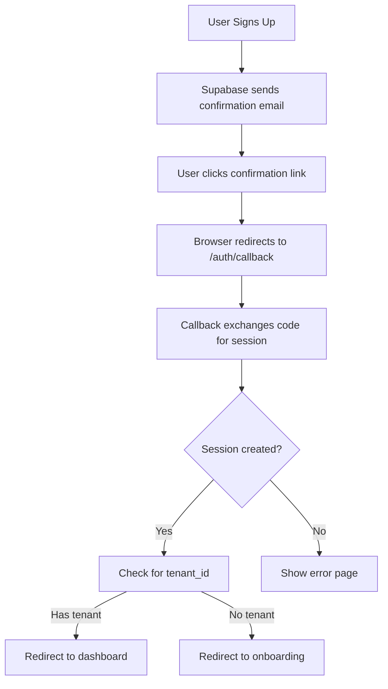

# CheersAI Authentication Setup Plan & Documentation

## 🎯 Executive Summary

This document provides a comprehensive analysis of the CheersAI authentication system and a plan to resolve the current authentication error: "Something went wrong during authentication. This could be due to an expired link or an invalid request."

---

## 🔍 Current Issue Analysis

### The Problem
When users click the confirmation link in their email, they're redirected to:
```
https://cheersai.orangejelly.co.uk/auth/callback?code=...&type=signup
```
But receive an authentication error instead of being logged in.

### Root Causes Identified

1. **URL Mismatch**: The Supabase project's Site URL was `http://localhost:3000` but emails are now redirecting to production
2. **Cookie Domain Issues**: Cookies set during auth callback might not match the production domain
3. **PKCE Token Expiry**: The PKCE tokens have a short lifespan and may be expiring
4. **Redirect URL Whitelist**: Production URL might not be in Supabase's allowed redirect URLs

---

## 🏗️ Current Authentication Architecture

### Technology Stack
- **Framework**: Next.js 15 with App Router
- **Auth Provider**: Supabase Auth
- **Session Management**: Server-side cookies with SSR
- **Security**: PKCE flow, RLS policies, secure cookies
- **Multi-tenancy**: Tenant isolation at database level

### Authentication Flow



### Key Components

#### 1. **Auth Callback Route** (`/app/auth/callback/route.ts`)
- Handles OAuth and email confirmation callbacks
- Exchanges authorization codes for sessions
- Sets secure HTTP-only cookies
- Determines redirect based on user state

#### 2. **Middleware** (`/middleware.ts`)
- Refreshes sessions on every request
- Maintains auth state across navigation
- Syncs cookies between client and server

#### 3. **Protected Routes** (`/app/(authed)/layout.tsx`)
- Server-side authentication check
- Redirects unauthenticated users
- Loads user and tenant data

#### 4. **Supabase Clients**
- **Server**: Uses cookies for SSR (`/lib/supabase/server.ts`)
- **Client**: Browser client with PKCE (`/lib/supabase/client.ts`)

---

## 🚨 Critical Configuration Requirements

### Supabase Dashboard Settings

#### 1. **Authentication → URL Configuration**
```
Site URL: https://cheersai.orangejelly.co.uk
Redirect URLs:
- https://cheersai.orangejelly.co.uk/**
- https://cheersai.orangejelly.co.uk/auth/callback
- https://cheersai.orangejelly.co.uk/auth/confirm
- https://cheersai.orangejelly.co.uk/auth/reset-password
```

#### 2. **Authentication → Email Templates**
Ensure all templates use:
- `{{ .SiteURL }}` for the base URL
- `{{ .ConfirmationURL }}` for the confirmation link
- Proper redirect_to parameter handling

#### 3. **Authentication → Providers → Email**
```
Enable Email Provider: ✓
Enable Email Confirmations: ✓
Enable Secure Email Change: ✓
Enable Secure Password Recovery: ✓
```

### Environment Variables (Production)

```env
# Required in Vercel
NEXT_PUBLIC_SUPABASE_URL=https://[project-id].supabase.co
NEXT_PUBLIC_SUPABASE_ANON_KEY=[anon-key]
SUPABASE_SERVICE_ROLE_KEY=[service-role-key]
NEXT_PUBLIC_APP_URL=https://cheersai.orangejelly.co.uk

# Optional but recommended
NODE_ENV=production
```

---

## 🔧 Immediate Fix Action Plan

### Step 1: Verify Supabase Configuration
```bash
# Check these in Supabase Dashboard:
1. Go to Settings → API
2. Note your Project URL and Anon Key
3. Go to Authentication → URL Configuration
4. Update Site URL to: https://cheersai.orangejelly.co.uk
5. Add production URLs to Redirect URLs whitelist
```

### Step 2: Update Email Templates (if custom)
If using custom email templates in Supabase:
```html
<!-- Ensure the confirmation URL uses the correct variable -->
<a href="{{ .ConfirmationURL }}">Confirm Email</a>
```

### Step 3: Verify Cookie Configuration
Check `/app/auth/callback/route.ts`:
```typescript
// Ensure cookies are set with correct options
cookieStore.set(key, value, {
  path: '/',
  sameSite: 'lax',
  httpOnly: true,
  secure: true  // Must be true in production
})
```

### Step 4: Test Authentication Flow
1. Clear browser cookies for the domain
2. Try signing up with a new email
3. Check the confirmation email URL format
4. Click the link and monitor browser DevTools
5. Check Network tab for any failed requests

---

## 📋 Comprehensive Fix Checklist

### Supabase Dashboard
- [ ] Site URL set to `https://cheersai.orangejelly.co.uk`
- [ ] Redirect URLs include all necessary production URLs
- [ ] Email templates using correct variables
- [ ] Email provider enabled and configured
- [ ] JWT expiry set appropriately (default: 3600 seconds)

### Vercel Deployment
- [ ] All environment variables set correctly
- [ ] `NEXT_PUBLIC_APP_URL` = `https://cheersai.orangejelly.co.uk`
- [ ] Build succeeded without warnings
- [ ] Domain properly configured

### Code Verification
- [ ] `/lib/utils/get-app-url.ts` returns production URL
- [ ] Auth callback handles errors gracefully
- [ ] Cookies set with `secure: true` in production
- [ ] Middleware refreshes sessions properly

### Testing
- [ ] New user signup flow works
- [ ] Email confirmation links work
- [ ] Password reset flow works
- [ ] Magic link login works
- [ ] Session persists across page navigation

---

## 🛠️ Debugging Guide

### How to Debug the Current Issue

1. **Check the Confirmation URL Format**
   ```
   Valid format:
   https://[supabase-project].supabase.co/auth/v1/verify?
     token=[token]&
     type=signup&
     redirect_to=https://cheersai.orangejelly.co.uk/auth/callback
   ```

2. **Inspect Browser DevTools**
   - Network tab: Check for failed requests
   - Console: Look for JavaScript errors
   - Application → Cookies: Verify cookies are set

3. **Check Supabase Logs**
   - Go to Supabase Dashboard → Logs → Auth
   - Look for authentication errors
   - Check for "invalid redirect_to" errors

4. **Verify Token Expiry**
   - PKCE tokens expire quickly (usually 5 minutes)
   - Check if user is clicking old links
   - Request new confirmation email if needed

---

## 🔐 Security Considerations

### Current Security Features
✅ PKCE flow for OAuth security
✅ Secure HTTP-only cookies
✅ Row Level Security (RLS) policies
✅ Tenant isolation at database level
✅ Server-side session validation
✅ Email confirmation required

### Recommended Enhancements
1. **Add Rate Limiting** - Prevent brute force attacks
2. **Implement Account Lockout** - After failed attempts
3. **Add Audit Logging** - Track all auth events
4. **Enable 2FA** - For high-value accounts
5. **Session Timeout** - Configurable inactivity timeout

---

## 📊 Monitoring & Alerts

### Key Metrics to Track
- Authentication success/failure rate
- Email confirmation completion rate
- Session duration distribution
- Failed login attempts per user
- Password reset request frequency

### Error Patterns to Monitor
- "Invalid redirect_to" errors
- "Token expired" errors
- "User not found" errors
- Cookie setting failures
- CORS issues

---

## 🎯 Next Steps

### Immediate (Fix Current Issue)
1. Update Supabase URL Configuration
2. Verify environment variables in Vercel
3. Test with a fresh signup
4. Monitor auth logs for errors

### Short-term (This Week)
1. Implement rate limiting on auth endpoints
2. Add comprehensive error logging
3. Create auth troubleshooting guide
4. Set up monitoring alerts

### Long-term (This Month)
1. Add 2FA support
2. Implement progressive account lockout
3. Create admin dashboard for auth monitoring
4. Add session management UI for users

---

## 📚 Additional Resources

### Supabase Documentation
- [Auth Deep Dive](https://supabase.com/docs/guides/auth/auth-deep-dive)
- [Server-side Auth with Next.js](https://supabase.com/docs/guides/auth/server-side/nextjs)
- [Row Level Security](https://supabase.com/docs/guides/auth/row-level-security)

### Next.js 15 Resources
- [App Router Authentication](https://nextjs.org/docs/app/building-your-application/authentication)
- [Middleware](https://nextjs.org/docs/app/building-your-application/routing/middleware)

### Debugging Tools
- [Supabase Auth Helpers Debugger](https://github.com/supabase/auth-helpers)
- [JWT.io](https://jwt.io/) - Decode JWT tokens
- [Postman](https://www.postman.com/) - Test auth endpoints

---

## 📝 Conclusion

The authentication system is well-architected but requires proper configuration alignment between Supabase, Vercel, and the application code. The immediate issue is likely a configuration mismatch that can be resolved by updating the Supabase project settings.

**Primary Action**: Update Supabase Dashboard → Authentication → URL Configuration → Site URL to `https://cheersai.orangejelly.co.uk`

This should resolve the immediate authentication error. Follow the comprehensive checklist above to ensure all components are properly configured.

---

*Document Version: 1.0*
*Last Updated: 2025-01-09*
*Author: CheersAI Development Team*