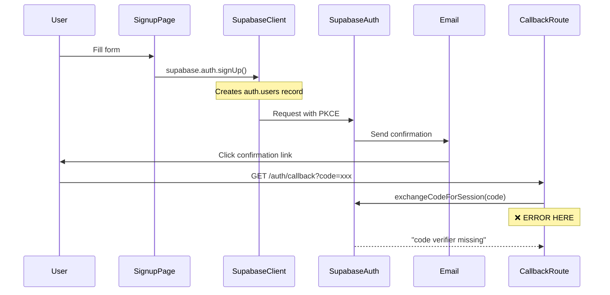

# 🔴 AUTHENTICATION SYSTEM DOCUMENTATION & PKCE ERROR ANALYSIS

## Executive Summary

The authentication system is failing with a PKCE (Proof Key for Code Exchange) error during the OAuth callback flow. The error indicates that Supabase is expecting PKCE parameters (code verifier) but not receiving them, suggesting a mismatch between the client-side auth initiation and server-side callback handling.

---

## Current Authentication Architecture

### Tech Stack
- **Framework**: Next.js 15.4.6 (App Router)
- **Auth Provider**: Supabase Auth v2
- **Client Library**: @supabase/ssr (Server-Side Rendering optimized)
- **Session Storage**: HTTP-only cookies via Supabase SSR

### File Structure
```
/lib/supabase/
├── client.ts       # Browser client (createBrowserClient)
├── server.ts       # Server client (createServerClient)
└── auth-cache.ts   # Auth caching layer (currently bypassed)

/app/auth/
├── signup/page.tsx     # Client component - signup form
├── login/page.tsx      # Client component - login form
├── callback/route.ts   # API route - handles OAuth callback
├── check-email/        # Email confirmation page
├── confirm/            # Success confirmation page
└── error/              # Error display page
```

---

## Authentication Flow Analysis

### 1. SIGNUP FLOW (Where the error occurs)



### 2. CURRENT IMPLEMENTATION

#### Client-Side Signup (`/app/auth/signup/page.tsx`)
```typescript
const { data, error } = await supabase.auth.signUp({
  email: formData.email,
  password: formData.password,
  options: {
    emailRedirectTo: `${window.location.origin}/auth/callback`,
    data: { /* user metadata */ }
  }
});
```

#### Server-Side Callback (`/app/auth/callback/route.ts`)
```typescript
// Receives only 'code' parameter
const code = requestUrl.searchParams.get("code");
const { error } = await supabase.auth.exchangeCodeForSession(code);
// ❌ FAILS: Missing code_verifier for PKCE
```

---

## 🔴 THE PKCE PROBLEM

### What is PKCE?
PKCE (RFC 7636) is an OAuth 2.0 extension that prevents authorization code interception attacks. It requires:

1. **code_challenge**: Generated client-side during auth initiation
2. **code_verifier**: Stored client-side, sent during token exchange
3. **code**: Authorization code from auth server

### The Issue
```
Error: "invalid request: both auth code and code verifier should be non-empty"
```

**Root Cause**: The Supabase client is initiating auth with PKCE enabled (default in v2), but the callback handler isn't providing the code_verifier during the exchange.

### Why This Happens

1. **Cookie Storage Issue**: The PKCE verifier is stored in cookies by the client
2. **Cookie Access Mismatch**: Server-side callback might not be reading the correct cookies
3. **Domain/Port Mismatch**: Cookies set on one domain/port aren't accessible on another

Evidence from logs:
- Signup initiated on `http://localhost:3002`
- Callback trying to exchange on same domain
- But referer shows `http://localhost:3000` in error logs

---

## 🔍 Critical Configuration Issues Found

### 1. PORT MISMATCH
```
App running on: localhost:3002
Error referer: localhost:3000
Callback URL: localhost:3002/auth/callback
```
**This suggests redirect URL mismatch in Supabase Dashboard**

### 2. MISSING MIDDLEWARE
No `/middleware.ts` file found to handle:
- Session refresh
- PKCE cookie management
- Auth state synchronization

### 3. CLIENT/SERVER MISMATCH
- Client uses `createBrowserClient` (supports PKCE)
- Server uses `createServerClient` (needs cookie bridge)
- No cookie synchronization between them

---

## 🛠️ RECOMMENDED FIXES

### Fix 1: Add Supabase Middleware (REQUIRED)
Create `/middleware.ts`:
```typescript
import { createServerClient } from '@supabase/ssr'
import { NextResponse } from 'next/server'
import type { NextRequest } from 'next/server'

export async function middleware(request: NextRequest) {
  let response = NextResponse.next({
    request: {
      headers: request.headers,
    },
  })

  const supabase = createServerClient(
    process.env.NEXT_PUBLIC_SUPABASE_URL!,
    process.env.NEXT_PUBLIC_SUPABASE_ANON_KEY!,
    {
      cookies: {
        get(name: string) {
          return request.cookies.get(name)?.value
        },
        set(name: string, value: string, options: any) {
          response.cookies.set({
            name,
            value,
            ...options,
          })
        },
        remove(name: string, options: any) {
          response.cookies.set({
            name,
            value: '',
            ...options,
          })
        },
      },
    }
  )

  // This will refresh the session if expired
  await supabase.auth.getUser()

  return response
}

export const config = {
  matcher: [
    '/((?!_next/static|_next/image|favicon.ico|.*\\.(?:svg|png|jpg|jpeg|gif|webp)$).*)',
  ],
}
```

### Fix 2: Update Callback Route
```typescript
// /app/auth/callback/route.ts
import { createServerClient } from '@supabase/ssr'
import { cookies } from 'next/headers'
import { NextResponse } from 'next/server'

export async function GET(request: Request) {
  const requestUrl = new URL(request.url)
  const code = requestUrl.searchParams.get('code')
  const origin = requestUrl.origin

  if (code) {
    const cookieStore = await cookies()
    
    // Create client with full cookie access
    const supabase = createServerClient(
      process.env.NEXT_PUBLIC_SUPABASE_URL!,
      process.env.NEXT_PUBLIC_SUPABASE_ANON_KEY!,
      {
        cookies: {
          get(name: string) {
            return cookieStore.get(name)?.value
          },
          set(name: string, value: string, options: any) {
            cookieStore.set({ name, value, ...options })
          },
          remove(name: string, options: any) {
            cookieStore.delete(name)
          },
        },
      }
    )

    // Exchange code with PKCE verifier from cookies
    const { error } = await supabase.auth.exchangeCodeForSession(code)
    
    if (!error) {
      return NextResponse.redirect(`${origin}/dashboard`)
    }
  }

  return NextResponse.redirect(`${origin}/auth/error`)
}
```

### Fix 3: Verify Supabase Dashboard Settings

**CRITICAL**: Check these settings in Supabase Dashboard:

1. **Site URL**: Should be `http://localhost:3002` (not 3000)
2. **Redirect URLs**: Must include:
   - `http://localhost:3002/auth/callback`
   - `http://localhost:3001/auth/callback` (if using both ports)
   - `http://localhost:3000/auth/callback` (if needed)

### Fix 4: Update Client Configuration
```typescript
// /lib/supabase/client.ts
import { createBrowserClient } from '@supabase/ssr'

export function createClient() {
  return createBrowserClient(
    process.env.NEXT_PUBLIC_SUPABASE_URL!,
    process.env.NEXT_PUBLIC_SUPABASE_ANON_KEY!,
    {
      cookies: {
        get(name: string) {
          // Ensure we can read PKCE cookies
          const value = document.cookie
            .split('; ')
            .find(row => row.startsWith(`${name}=`))
            ?.split('=')[1]
          return value
        },
        set(name: string, value: string, options: any) {
          // Ensure cookies are set correctly
          document.cookie = `${name}=${value}; path=/; SameSite=Lax`
        },
        remove(name: string) {
          document.cookie = `${name}=; path=/; expires=Thu, 01 Jan 1970 00:00:00 GMT`
        }
      },
      auth: {
        flowType: 'pkce',  // Explicitly set PKCE
        detectSessionInUrl: true,
        persistSession: true,
      }
    }
  )
}
```

---

## 🐛 Debugging Steps

### 1. Check Current Cookie State
Add to callback route:
```typescript
console.log('All cookies:', cookieStore.getAll())
console.log('PKCE verifier:', cookieStore.get('sb-auth-token-code-verifier'))
```

### 2. Verify Redirect URLs
```bash
# Check what's configured in Supabase
curl https://[project-ref].supabase.co/auth/v1/settings
```

### 3. Test with Logging
```typescript
// In signup page
console.log('Signup redirect URL:', `${window.location.origin}/auth/callback`)
console.log('Current origin:', window.location.origin)

// In callback
console.log('Callback origin:', requestUrl.origin)
console.log('Code received:', code)
```

---

## 🚨 Immediate Actions Required

1. **CHECK SUPABASE DASHBOARD**
   - Verify redirect URLs match your dev port (3002)
   - Ensure PKCE is enabled in Auth settings

2. **ADD MIDDLEWARE**
   - Create `/middleware.ts` with cookie handling
   - This is REQUIRED for Supabase Auth v2 with SSR

3. **UPDATE CALLBACK**
   - Ensure proper cookie access
   - Handle PKCE flow correctly

4. **TEST AUTH FLOW**
   - Clear all cookies
   - Try signup again
   - Check console for cookie values

---

## 📊 Testing Checklist

- [ ] Middleware created and working
- [ ] Cookies being set on signup
- [ ] PKCE verifier present in cookies
- [ ] Callback can read cookies
- [ ] Exchange includes verifier
- [ ] Session created successfully
- [ ] User redirected correctly
- [ ] Tenant creation works

---

## 🔗 Related Issues

1. **Multi-port development**: Running on 3002 but errors show 3000
2. **No session persistence**: Missing middleware
3. **Tenant creation**: Now fixed with SECURITY DEFINER
4. **User creation**: Trigger added but needs session first

---

## Senior Developer Questions

1. **Should we disable PKCE for local dev?** (Not recommended but possible)
2. **Why multiple ports?** (3000, 3001, 3002 all referenced)
3. **Should auth be in API routes only?** (More control over cookies)
4. **Need custom auth UI?** (Supabase UI available)
5. **Production deployment plan?** (Different cookie settings needed)

---

**Created**: 2024-12-29
**Severity**: CRITICAL - Blocks all authentication
**Component**: Supabase Auth + Next.js Integration