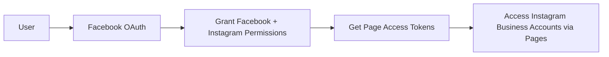
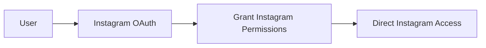

# Instagram Integration Analysis & Fix Plan

## Executive Summary
The Instagram integration is fundamentally broken due to mixing incompatible OAuth approaches, using deprecated APIs, and implementing incorrect authentication flows. The application attempts to use Instagram Basic Display API (deprecated Dec 4, 2024) with Instagram Business API scopes, which is impossible.

## Critical Issues Identified

### 1. ❌ **WRONG API**: Using Deprecated Instagram Basic Display API
**Location**: `/app/api/social/connect/route.ts`
```typescript
// WRONG - This is Instagram Basic Display API (DEPRECATED)
authUrl = `https://www.instagram.com/oauth/authorize?`
```
**Impact**: This API was shut down on December 4, 2024. It no longer works.

### 2. ❌ **WRONG APP**: Using Instagram App Instead of Facebook App
**Issue**: Created a separate Instagram app (1138649858083556) when should use Facebook app
**Impact**: Instagram Business API requires Facebook app credentials, not Instagram app

### 3. ❌ **WRONG SCOPES**: Using Non-Existent Permissions
**Location**: Multiple files
```typescript
// These scopes DON'T EXIST
"instagram_business_basic"
"instagram_business_manage_messages"
"instagram_business_content_publish"
```
**Correct Scopes**:
```typescript
"instagram_basic"
"instagram_content_publish"
"pages_show_list"
"pages_read_engagement"
```

### 4. ❌ **CONFLICTING FLOWS**: Three Different OAuth Implementations
- **Flow 1**: Direct Instagram OAuth (deprecated)
- **Flow 2**: Facebook OAuth with Instagram scopes (partially correct)
- **Flow 3**: Facebook Page token approach (correct but incomplete)

### 5. ❌ **HARDCODED CREDENTIALS**: Security Risk
**Location**: Multiple files
```typescript
const INSTAGRAM_APP_ID = "1138649858083556"; // Hardcoded
const INSTAGRAM_APP_SECRET = "554404bd201993ac8f7d055f33d4a530"; // EXPOSED
```

### 6. ❌ **INCORRECT TOKEN EXCHANGE**: Using Wrong Endpoints
**Location**: `/app/api/auth/callback/instagram-business/route.ts`
```typescript
// WRONG - Using Facebook endpoint for Instagram app
const tokenUrl = `https://graph.facebook.com/v20.0/oauth/access_token?`
```

### 7. ❌ **DATABASE CONFUSION**: Multiple Table References
- Some code uses `social_connections`
- Other code uses `social_accounts`
- Inconsistent field names

### 8. ❌ **NO TOKEN REFRESH**: Tokens Expire After 60 Days
- No mechanism to refresh tokens
- No notification when tokens expire
- Users must manually reconnect

### 9. ❌ **MIXED REDIRECT URIS**: Inconsistent Callbacks
- `/api/auth/callback/instagram-business`
- `/api/social/callback`
- Different URIs in different files

### 10. ❌ **API VERSION**: Using v20.0 When v21.0+ Available
- Should use latest stable version
- v20.0 will be deprecated May 2025

## Root Cause Analysis

The fundamental issue is that the implementation was built for Instagram Basic Display API, which:
1. Was designed for personal Instagram accounts
2. Used direct Instagram OAuth
3. Had different scopes and endpoints
4. **Was deprecated on December 4, 2024**

The current code tries to adapt this to Instagram Business API but fails because:
- Instagram Business API requires Facebook OAuth
- It uses completely different scopes
- It requires Facebook Page connections
- It uses Facebook app credentials, not Instagram app credentials

## Correct Implementation Path

### Option 1: Facebook Login for Instagram Business (RECOMMENDED)


**Pros**:
- Official supported method
- Access to all Instagram Business features
- Single OAuth flow for both Facebook and Instagram

**Cons**:
- Requires Facebook Page
- More complex setup

### Option 2: Instagram API with Instagram Login (NEW - 2025)


**Pros**:
- Simpler flow
- No Facebook Page required

**Cons**:
- Limited API access
- Newer, less documented

## Detailed Fix Plan

### Phase 1: Remove Broken Code
1. Delete `/app/api/auth/callback/instagram-business/route.ts` (uses wrong approach)
2. Remove Instagram-specific OAuth from `/app/api/social/connect/route.ts`
3. Delete hardcoded Instagram app credentials
4. Remove `/components/social/instagram-connect-button.tsx` (conflicting implementation)

### Phase 2: Implement Correct OAuth Flow
1. **Use Facebook App for Instagram**:
   ```typescript
   // Use existing Facebook app credentials
   const FACEBOOK_APP_ID = process.env.NEXT_PUBLIC_FACEBOOK_APP_ID;
   const FACEBOOK_APP_SECRET = process.env.FACEBOOK_APP_SECRET;
   ```

2. **Update OAuth URL**:
   ```typescript
   const authUrl = `https://www.facebook.com/v21.0/dialog/oauth?` +
     `client_id=${FACEBOOK_APP_ID}&` +
     `redirect_uri=${redirectUri}&` +
     `scope=pages_show_list,pages_read_engagement,instagram_basic,instagram_content_publish,instagram_manage_comments,instagram_manage_insights`;
   ```

3. **Single Callback Handler**:
   - Use `/api/social/callback` for both Facebook and Instagram
   - Detect Instagram Business accounts from Facebook Pages
   - Store both connections

### Phase 3: Fix Token Management
1. **Token Exchange**:
   ```typescript
   // Exchange code for token using Facebook credentials
   const tokenUrl = `https://graph.facebook.com/v21.0/oauth/access_token?` +
     `client_id=${FACEBOOK_APP_ID}&` +
     `client_secret=${FACEBOOK_APP_SECRET}&` +
     `redirect_uri=${redirectUri}&` +
     `code=${code}`;
   ```

2. **Get Instagram Business Accounts**:
   ```typescript
   // Get Facebook Pages
   const pagesResponse = await fetch(
     `https://graph.facebook.com/v21.0/me/accounts?access_token=${token}`
   );
   
   // For each page, check for Instagram Business Account
   for (const page of pages) {
     const igResponse = await fetch(
       `https://graph.facebook.com/v21.0/${page.id}?fields=instagram_business_account&access_token=${page.access_token}`
     );
   }
   ```

3. **Store Tokens Properly**:
   ```typescript
   // Store page access token for Instagram API calls
   await supabase.from('social_connections').insert({
     platform: 'instagram_business',
     account_id: instagram_business_account.id,
     access_token: page.access_token, // Page token, not user token
     page_id: page.id,
     token_expires_at: // Calculate 60 days from now
   });
   ```

### Phase 4: Update Database
1. Standardize on `social_connections` table
2. Add migration to ensure consistent schema
3. Add `token_type` field to distinguish token types
4. Add `last_refreshed` timestamp

### Phase 5: Implement Token Refresh
1. Create cron job to check expiring tokens
2. Implement token refresh flow
3. Notify users before tokens expire
4. Add manual refresh button in UI

### Phase 6: Testing & Validation
1. Test with Facebook test users
2. Verify all scopes are granted
3. Test posting to Instagram
4. Verify webhook functionality
5. Test token refresh

## Implementation Priority

### Immediate (Fix OAuth - 2-3 days)
1. ✅ Remove broken Instagram-specific OAuth code
2. ✅ Use Facebook OAuth for Instagram Business
3. ✅ Fix scope requests
4. ✅ Update to v21.0 API

### Short-term (Token Management - 1-2 days)
1. ⏳ Implement proper token storage
2. ⏳ Add token refresh mechanism
3. ⏳ Fix database schema

### Medium-term (Polish - 1 day)
1. ⏳ Better error messages
2. ⏳ Add retry logic
3. ⏳ Improve logging

## Required Facebook App Settings

### Facebook Login Settings
```
Valid OAuth Redirect URIs:
- https://cheersai.orangejelly.co.uk/api/social/callback

Required Permissions:
- email
- public_profile
- pages_show_list
- pages_read_engagement
- instagram_basic
- instagram_content_publish
- instagram_manage_comments
- instagram_manage_insights
```

### Remove Instagram App
The separate Instagram app (1138649858083556) should be:
1. Marked as deprecated
2. Eventually deleted
3. All references removed from code

## Success Criteria

1. ✅ Users can connect Instagram Business accounts via Facebook OAuth
2. ✅ Connection persists and tokens are properly stored
3. ✅ Can post content to Instagram
4. ✅ Tokens refresh automatically before expiration
5. ✅ Clear error messages for common issues
6. ✅ No hardcoded credentials in codebase

## Estimated Timeline

- **Day 1-2**: Remove broken code, implement correct OAuth
- **Day 3**: Fix token management and database
- **Day 4**: Add token refresh and error handling
- **Day 5**: Testing and documentation

Total: **5 days** for complete fix

## Risk Mitigation

1. **Risk**: Breaking existing Facebook connections
   **Mitigation**: Test extensively, implement gradual rollout

2. **Risk**: Users losing Instagram connections
   **Mitigation**: Backup current connections, provide migration path

3. **Risk**: Facebook API changes
   **Mitigation**: Use stable API version, monitor deprecation notices

## Conclusion

The Instagram integration requires a complete rewrite using the correct Facebook OAuth flow for Instagram Business API. The current implementation mixes incompatible approaches and uses deprecated APIs. Following this plan will result in a stable, maintainable Instagram integration that complies with Meta's current API requirements.