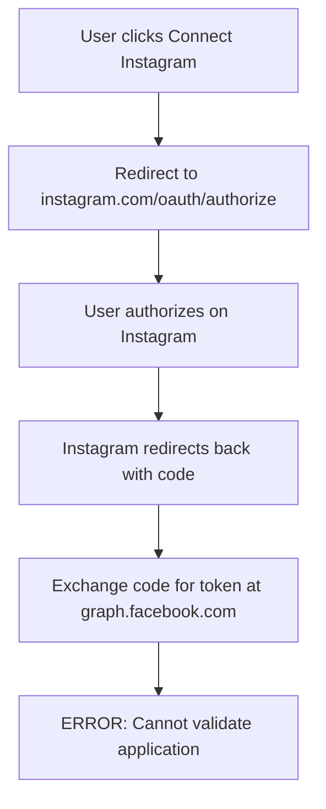
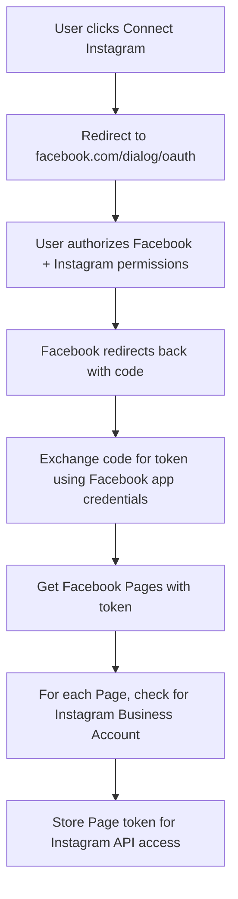

# Instagram Integration Technical Review Document

## Executive Summary
The Instagram integration is failing because we're using the wrong OAuth approach. We're attempting to use Instagram's direct OAuth (which was part of the now-deprecated Basic Display API) when we should be using Facebook OAuth to access Instagram Business accounts.

---

## PART 1: CURRENT IMPLEMENTATION (What We Have)

### 1.1 OAuth Flow Currently Implemented



### 1.2 Current Code Structure

#### OAuth Initiation (`/app/api/social/connect/route.ts`)
```typescript
// CURRENT IMPLEMENTATION
case "instagram_business":
  const INSTAGRAM_APP_ID = "1138649858083556";  // Separate Instagram app
  
  authUrl = `https://www.instagram.com/oauth/authorize?` +
    `client_id=${INSTAGRAM_APP_ID}&` +
    `redirect_uri=${encodeURIComponent(igRedirectUri)}&` +
    `response_type=code&` +
    `scope=${igScopes}&` +  // Using invalid scopes
    `state=${state}`;
```

#### Token Exchange (`/app/api/auth/callback/instagram-business/route.ts`)
```typescript
// CURRENT TOKEN EXCHANGE
const tokenUrl = `https://graph.facebook.com/v20.0/oauth/access_token?` +
  `client_id=${INSTAGRAM_APP_ID}` +  // Using Instagram app ID
  `&client_secret=${INSTAGRAM_APP_SECRET}` +  // Using Instagram app secret
  `&redirect_uri=${encodeURIComponent(igCallbackUrl)}` +
  `&code=${code}`;
```

### 1.3 Current App Configuration

**We have TWO separate apps:**
1. **Facebook App** (ID: 1001401138674450)
   - Used for Facebook connections
   - Has "Facebook Login for Business" product

2. **Instagram App** (ID: 1138649858083556)
   - Attempting to use for Instagram connections
   - Has "Instagram Business Login" configured

### 1.4 Current Scopes Being Requested

```typescript
const igScopes = [
  "instagram_business_basic",      // ❌ DOESN'T EXIST
  "instagram_business_manage_messages",  // ❌ DOESN'T EXIST
  "instagram_business_manage_comments",  // ❌ DOESN'T EXIST
  "instagram_business_content_publish",  // ❌ DOESN'T EXIST
  "instagram_business_manage_insights"   // ❌ DOESN'T EXIST
];
```

### 1.5 Why Current Implementation Fails

1. **Mixing APIs**: Using Instagram OAuth URL with Facebook Graph API endpoints
2. **Wrong Scopes**: Requesting scopes that don't exist
3. **Wrong App**: Using separate Instagram app instead of Facebook app
4. **Deprecated Flow**: Instagram Basic Display API was shut down December 4, 2024

---

## PART 2: CORRECT IMPLEMENTATION (How It Should Work)

### 2.1 Correct OAuth Flow



### 2.2 Correct Implementation Code

#### OAuth Initiation (How it SHOULD be)
```typescript
case "instagram_business":
  const FACEBOOK_APP_ID = process.env.NEXT_PUBLIC_FACEBOOK_APP_ID;  // Use Facebook app
  
  // Use Facebook OAuth with Instagram permissions
  authUrl = `https://www.facebook.com/v21.0/dialog/oauth?` +
    `client_id=${FACEBOOK_APP_ID}&` +  // Facebook app ID
    `redirect_uri=${encodeURIComponent(redirectUri)}&` +
    `response_type=code&` +
    `scope=email,public_profile,pages_show_list,pages_read_engagement,instagram_basic,instagram_content_publish,instagram_manage_comments,instagram_manage_insights&` +
    `state=${state}`;
```

#### Token Exchange (How it SHOULD be)
```typescript
// Exchange code for token using FACEBOOK credentials
const tokenUrl = `https://graph.facebook.com/v21.0/oauth/access_token?` +
  `client_id=${FACEBOOK_APP_ID}` +  // Facebook app ID
  `&client_secret=${FACEBOOK_APP_SECRET}` +  // Facebook app secret
  `&redirect_uri=${encodeURIComponent(redirectUri)}` +
  `&code=${code}`;

// Then get Facebook Pages
const pagesResponse = await fetch(
  `https://graph.facebook.com/v21.0/me/accounts?access_token=${token}`
);

// For each page, check for Instagram Business Account
for (const page of pages.data) {
  const igResponse = await fetch(
    `https://graph.facebook.com/v21.0/${page.id}?` +
    `fields=instagram_business_account{id,username,profile_picture_url}&` +
    `access_token=${page.access_token}`
  );
  
  if (igResponse.instagram_business_account) {
    // Store this Instagram Business Account with the Page access token
    await storeInstagramConnection({
      instagram_id: igResponse.instagram_business_account.id,
      access_token: page.access_token,  // Use Page token, not user token
      page_id: page.id
    });
  }
}
```

### 2.3 Correct Scopes

```typescript
// CORRECT Facebook/Instagram scopes
const scopes = [
  // Facebook permissions
  "email",
  "public_profile",
  "pages_show_list",
  "pages_read_engagement",
  
  // Instagram permissions (via Facebook)
  "instagram_basic",
  "instagram_content_publish",
  "instagram_manage_comments",
  "instagram_manage_insights",
  
  // Optional
  "business_management"  // For advanced features
];
```

### 2.4 Required Facebook App Configuration

**In Facebook Developer Console:**

1. **Products to Add:**
   - Facebook Login (regular, not "for Business" initially)
   - Instagram Graph API

2. **Facebook Login Settings:**
   ```
   Valid OAuth Redirect URIs:
   - https://cheersai.orangejelly.co.uk/api/social/callback
   
   Settings:
   - Client OAuth Login: ON
   - Web OAuth Login: ON
   - Enforce HTTPS: ON
   ```

3. **App Review Permissions Needed:**
   - `instagram_basic` - Read Instagram account info
   - `instagram_content_publish` - Publish to Instagram
   - `pages_show_list` - Access Facebook Pages
   - `pages_read_engagement` - Read Page data

### 2.5 Database Storage

```sql
-- How Instagram connections should be stored
INSERT INTO social_connections (
  tenant_id,
  platform,
  account_id,        -- Instagram Business Account ID
  account_name,      -- Instagram username
  access_token,      -- Facebook PAGE access token (not user token)
  page_id,          -- Associated Facebook Page ID
  page_name,        -- Facebook Page name
  metadata          -- Store instagram_id, profile_picture_url, etc.
) VALUES (...);
```

---

## PART 3: KEY DIFFERENCES

| Aspect | Current (Wrong) | Correct |
|--------|----------------|---------|
| **OAuth URL** | instagram.com/oauth/authorize | facebook.com/dialog/oauth |
| **App Used** | Instagram App (1138649858083556) | Facebook App (1001401138674450) |
| **Credentials** | Instagram app secret | Facebook app secret |
| **Scopes** | instagram_business_* (invalid) | instagram_basic, instagram_content_publish |
| **Token Type** | Attempting user token | Page access token |
| **API Endpoint** | Mixed Instagram/Facebook | Facebook Graph API only |

---

## PART 4: MIGRATION PATH

### Step 1: Remove Instagram App Dependencies
```bash
# Remove all references to Instagram app ID 1138649858083556
# Remove INSTAGRAM_APP_SECRET from environment variables
# Delete /app/api/auth/callback/instagram-business/route.ts
```

### Step 2: Update OAuth Flow
```typescript
// Update /app/api/social/connect/route.ts
// Change Instagram case to use Facebook OAuth
// Use Facebook app credentials
// Request correct scopes
```

### Step 3: Unify Callback Handler
```typescript
// Use single callback: /app/api/social/callback
// Handle both Facebook and Instagram in same flow
// Instagram accounts come from Facebook Pages
```

### Step 4: Update Environment Variables
```env
# Remove these:
INSTAGRAM_APP_ID=...
INSTAGRAM_APP_SECRET=...

# Keep these:
NEXT_PUBLIC_FACEBOOK_APP_ID=1001401138674450
FACEBOOK_APP_SECRET=089a1b973dab96f26e4cc6d053637d8a
```

---

## PART 5: ERROR EXPLANATION

### The Current Error
```
"Error validating application. Cannot get application info due to a system error."
```

### Why This Happens
1. We're sending an Instagram app ID to Facebook's Graph API
2. Facebook's API can't validate an Instagram app credential
3. The OAuth flow expects Facebook app credentials but receives Instagram ones
4. The scopes we're requesting don't exist in the context we're using

### Technical Root Cause
```typescript
// This fails because:
`https://graph.facebook.com/v20.0/oauth/access_token?client_id=${INSTAGRAM_APP_ID}`
// Facebook Graph API expects a Facebook app ID, not Instagram app ID
```

---

## PART 6: TESTING APPROACH

### Local Testing
```bash
# 1. Update environment variables
NEXT_PUBLIC_FACEBOOK_APP_ID=1001401138674450
FACEBOOK_APP_SECRET=089a1b973dab96f26e4cc6d053637d8a

# 2. Remove Instagram-specific variables
# 3. Test OAuth flow with Facebook test users
```

### Production Testing
1. Add yourself as app admin in Facebook Developer Console
2. Test with your own Instagram Business account
3. Verify Page access tokens are stored correctly
4. Test posting to Instagram via Graph API

---

## PART 7: API ENDPOINTS FOR INSTAGRAM

### After Correct Implementation
```typescript
// Get Instagram account info
GET https://graph.facebook.com/v21.0/{ig-user-id}?access_token={page-access-token}

// Publish to Instagram
POST https://graph.facebook.com/v21.0/{ig-user-id}/media
{
  "image_url": "...",
  "caption": "...",
  "access_token": "{page-access-token}"
}

// Get insights
GET https://graph.facebook.com/v21.0/{ig-user-id}/insights?metric=impressions,reach
```

---

## RECOMMENDATIONS FOR SENIOR DEVELOPER

### Critical Issues to Address
1. **Remove Instagram App**: The separate Instagram app is unnecessary and causing confusion
2. **Use Facebook OAuth**: Instagram Business API requires Facebook OAuth, not Instagram OAuth
3. **Fix Scopes**: Use valid Facebook/Instagram scopes, not made-up ones
4. **Store Page Tokens**: Instagram API calls need Facebook Page tokens, not user tokens

### Quick Fix (Temporary)
If you need this working immediately:
1. Comment out Instagram connection option
2. Use Facebook connection only
3. Access Instagram accounts through Facebook Pages
4. This already partially works in the codebase

### Proper Fix (Recommended)
1. Complete rewrite using Facebook OAuth
2. Remove all Instagram-specific OAuth code
3. Implement proper token management
4. Add token refresh mechanism (tokens expire after 60 days)

### Time Estimate
- Quick Fix: 1-2 hours
- Proper Fix: 2-3 days
- With Testing: 4-5 days

---

## APPENDIX: Useful Resources

1. **Instagram Business API Documentation**
   - https://developers.facebook.com/docs/instagram-api
   
2. **Facebook OAuth Documentation**
   - https://developers.facebook.com/docs/facebook-login/guides/advanced/manual-flow

3. **Graph API Explorer (for testing)**
   - https://developers.facebook.com/tools/explorer/

4. **Access Token Debugger**
   - https://developers.facebook.com/tools/debug/accesstoken/

---

## Questions for Senior Developer

1. Should we continue supporting Instagram as a separate connection or only via Facebook?
2. Do we need to support Instagram Creator accounts or just Business accounts?
3. Should we implement token refresh (60-day expiry) or manual reconnection?
4. Do we need to maintain backward compatibility with existing connections?

---

*Document prepared for senior developer review. The core issue is that we're using Instagram's deprecated OAuth flow instead of Facebook's OAuth flow for Instagram Business API access.*