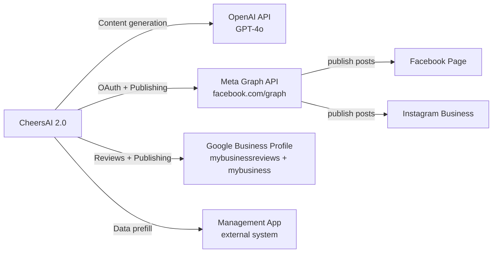

← [[_Index]] / [[_API MOC]]

# External Integrations



## OpenAI (`src/lib/ai/client.ts`)

- **API**: OpenAI Chat Completions (`gpt-4o` or configured model)
- **Usage**: Content generation for all campaign types
- **Prompt structure**: System message (CheersAI persona + brand rules) + User message (request details)
- **Key file**: `src/lib/ai/prompts.ts` — `buildInstantPostPrompt()`
- **Auth**: `OPENAI_API_KEY` environment variable

> [!NOTE]
> The AI persona is "CheersAI" — always writes in British English as a pub team in first-person plural. Strict grammar rules enforce correct "we/us/our" usage. See [[Content Creation & Campaigns]] for prompt architecture details.

## Meta Graph API (`src/lib/meta/graph.ts`)

- **Base URL**: `https://graph.facebook.com/v{version}` (version configured via env or constant)
- **Auth**: Page Access Tokens (long-lived, ~60 days) stored in `social_connections.access_token`
- **Key operations**:
  - `/oauth/access_token` — Token exchange (short-lived → long-lived)
  - `/me/accounts` — Fetch managed Facebook Pages with linked Instagram accounts
  - `/{pageId}/feed` — Publish Facebook post
  - Instagram container creation → publish via IG Graph API endpoints

### Facebook Token Lifecycle

```
User auth code
    → Short-lived user token (1–2 hours)
    → Long-lived user token (60 days) via fb_exchange_token
    → Page access token (extracted from /me/accounts)
```

The Page access token is what's stored. Facebook Page tokens effectively do not expire unless the user revokes access or changes their password.

## Google Business Profile API

- **Reviews API**: `https://mybusinessreviews.googleapis.com/v1`
  - `GET /{locationId}/reviews` — Fetch reviews (paginated, 50/page)
  - `PUT /{reviewName}/reply` — Post a reply
- **Business Info API**: `https://mybusiness.googleapis.com/v4` (or `mybusinessaccountmanagement`)
  - Used to resolve canonical location IDs
- **Auth**: OAuth 2.0 with offline access (refresh token stored)
- **Token refresh**: `https://oauth2.googleapis.com/token` with `grant_type=refresh_token`
- **Rate limits**: The GBP API has strict per-minute and per-day quotas. Rate limit errors (HTTP 429) are wrapped in `GbpRateLimitError` with `retryAfterMs` extracted from the `Retry-After` header.

> [!WARNING] Location ID Format
> GBP location IDs must be `locations/{numericId}` (canonical form). The `resolveGoogleLocation()` process calls the GBP Business Info API to discover the canonical form. Place IDs (`locations/ChIJ...`) are rejected by the Reviews API. See `src/lib/gbp/location-id.ts` for normalisation logic.

## Management App (`src/lib/management-app/`)

- An external management application (The Anchor's management system) provides venue data
- `getManagementAppData()` fetches events, menus, and other venue information to pre-fill content creation forms
- `mappers.ts` transforms management app data to CheersAI's internal types
- Auth: API key or token (configured per deployment)

> [!INFO]
> The management app integration is specific to The Anchor (Orange Jelly's pub client). Other deployments may not use this.
