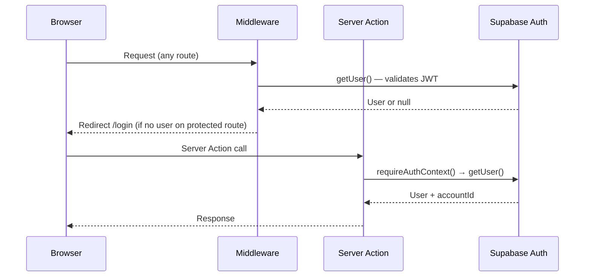
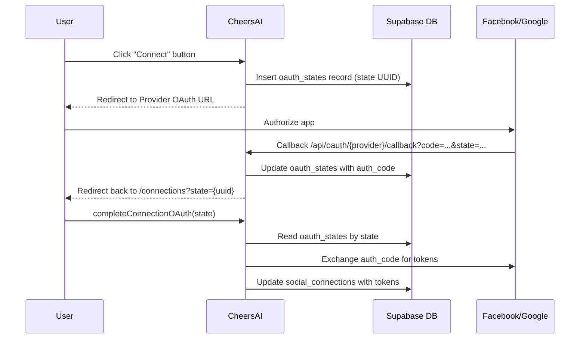

← [[_Index]] / [[_Architecture MOC]]

# Auth & Security

## Authentication Model

CheersAI 2.0 uses **Supabase Auth with JWT + HTTP-only cookies** managed by `@supabase/ssr`. There is no custom session layer — auth is handled entirely through Supabase JWT refresh cycles.

## Supabase Client Files

| File | Key | Purpose |
|------|-----|---------|
| `src/lib/supabase/server.ts` | Anon key | Cookie-based SSR client for Server Components and Actions |
| `src/lib/supabase/service.ts` | Service-role | Bypasses RLS — admin operations only |
| `src/lib/supabase/client.ts` | Anon key | Browser client (if used in client components) |
| `src/lib/supabase/route.ts` | Anon key | Route handler variant |

> [!WARNING]
> The service-role client (`createServiceSupabaseClient`) bypasses all RLS policies. It is only legitimate for system operations: publishing jobs, OAuth state management, cron jobs. Never use it for user-scoped data reads.

## Auth Helpers (`src/lib/auth/server.ts`)

### `requireAuthContext()`
Used in every server action and server component that needs auth. Returns `{ supabase, user, accountId }`. If no session exists, clears stale Supabase cookies and redirects to `/login`.

The function also calls `ensureAccountRecord()` on every authenticated request — creating the `accounts` row via upsert if it doesn't exist yet (new user scenario).

### `getCurrentUser()`
Calls `requireAuthContext()` and then fetches the full `accounts` row to return an `AppUser` with `id`, `email`, `displayName`, `timezone`.

### Account ID Resolution
`resolveAccountId()` reads from `user.app_metadata.account_id` (server-managed, trusted) before falling back to `user.id`. This supports multi-venue scenarios where an operator's account is pre-provisioned with a known ID.

## Middleware

The middleware (`middleware.ts`) runs on all requests:
1. Calls `getUser()` (never `getSession()`) to silently refresh the JWT
2. Checks against a public path allowlist: `/login`, `/auth/*`, `/api/auth/*`, `/l/*` (link-in-bio), `/privacy`, `/terms`
3. Redirects unauthenticated users to `/login`

Security headers are applied to all responses (see `Overview.md` for the workspace auth standard).

## OAuth Flow (Social Connections)

OAuth state records expire: unused after 30 minutes, used after 24 hours. Cleanup runs on every OAuth initiation.

## Row Level Security

RLS is enabled on all tables (migration `20250212150000_enable_rls.sql`). Every query through the anon-key client automatically filters to the authenticated user's data. The service-role client used in cron jobs and publish operations bypasses RLS intentionally.

> [!NOTE]
> `src/lib/supabase/errors.ts` provides `isSchemaMissingError()` which returns true for Postgres error code `42P01` (undefined table). All data functions check this to return graceful fallbacks when the schema hasn't been migrated yet.
