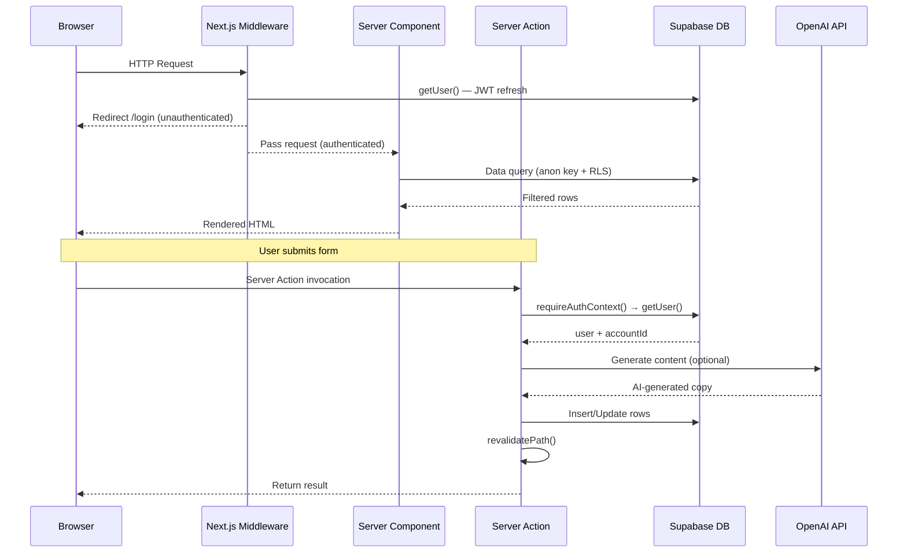
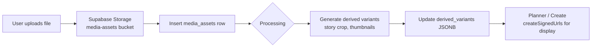

← [[_Index]] / [[_Architecture MOC]]

# Data Flow

## Request Lifecycle



## Content Creation & Publishing Pipeline

```mermaid
graph TD
  A[User fills Create Wizard] -->|Submit| B[Server Action: createContent]
  B --> C[Fetch OwnerSettings\nbrand profile, venue name]
  C --> D[Build OpenAI Prompt\nbuildInstantPostPrompt]
  D --> E[Call GPT-4o\napply content rules + postprocess]
  E --> F[Insert content_items row]
  F --> G[Insert content_variants row\nwith generated copy]
  G --> H{Publish mode?}
  H -->|Now| I[enqueuePublishJob\nscheduledFor=now]
  H -->|Schedule| J[enqueuePublishJob\nscheduledFor=future]
  H -->|Draft| K[Status = draft\nno publish job]
  I --> L[publish_jobs row\nstatus=queued]
  J --> L
  L --> M[Cron: /api/cron/publish]
  M --> N[Supabase Edge Function\npublish-queue]
  N --> O{Platform}
  O -->|facebook| P[Meta Graph API\n/me/feed or /{pageId}/feed]
  O -->|instagram| Q[Meta Graph API\nIG container → publish]
  O -->|gbp| R[GBP API\n/localPosts or /reviews]
  P & Q & R --> S[Update content_items status\nposted / failed]
```

## Media Asset Flow



## Planner Data Loading

The planner loads three data sets in parallel via `getPlannerOverview()`:
1. `content_items` in a date range — with joined `campaigns` and `content_variants` for media previews
2. `notifications` — unread activity entries for the activity feed
3. Trashed `content_items` — soft-deleted items (`deleted_at IS NOT NULL`)

Media preview URLs are generated in a second pass: asset IDs are extracted from `content_variants.media_ids`, then `createSignedUrls()` is called in one batch. Story-placement content prefers story-cropped derived variants.

## Settings Resolution

Owner settings are loaded via `getOwnerSettings()` which queries three tables in parallel:
- `accounts` → timezone, display_name
- `link_in_bio_profiles` → display_name (used as venue name, takes priority)
- `brand_profile` → tone sliders, key phrases, banned topics/phrases, hashtags, emojis, signatures
- `posting_defaults` → GBP CTA types, notification preferences, location IDs
