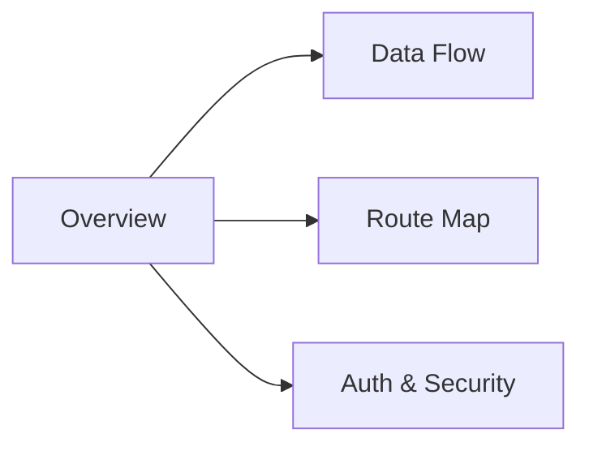

← [[_Index]]

# Architecture

High-level technical architecture of CheersAI 2.0 — stack decisions, request flow, route map, and security model.



## Documents

```dataview
TABLE status, last_updated
FROM "Obsidian/OJ-CheersAI2.0/Architecture"
WHERE file.name != "_Architecture MOC"
SORT last_updated DESC
```

## Related

- [[_Database MOC]] — Underlying schema
- [[_API MOC]] — Server actions and routes
- [[_Features MOC]] — Feature behaviour
