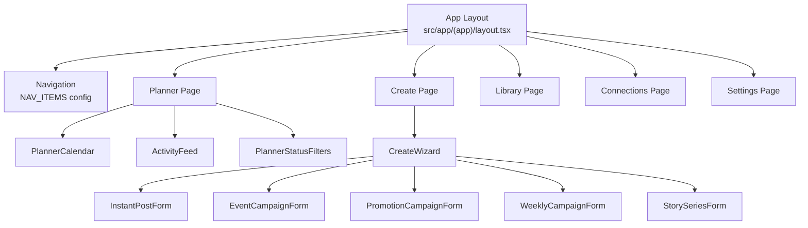

← [[_Index]]

# Components

UI component catalog for CheersAI 2.0.

## Component Organisation

Components follow a **feature-scoped** pattern — each feature has its own directory under `src/features/`. Shared/primitive components live in a `src/components/` directory (if present) or are imported from the UI library.



## Documents

```dataview
TABLE status, last_updated
FROM "Obsidian/OJ-CheersAI2.0/Components"
WHERE file.name != "_Components MOC"
SORT file.name ASC
```

## Related

- [[_Features MOC]]
- [[_Architecture MOC]]
