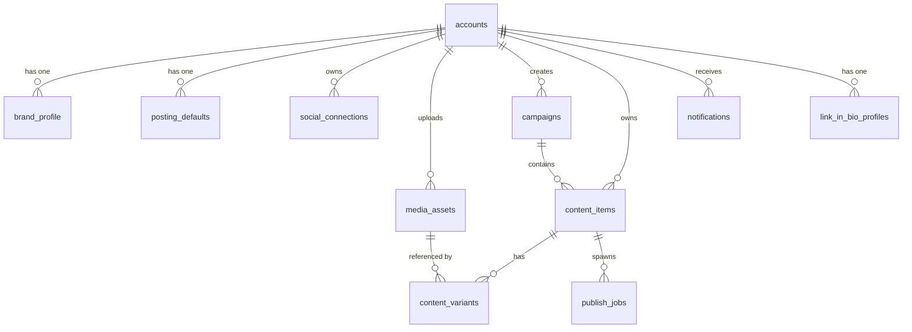

← [[_Index]]

# Database

Supabase PostgreSQL schema, RLS policies, and migration history.



## Documents

```dataview
TABLE status, last_updated
FROM "Obsidian/OJ-CheersAI2.0/Database"
WHERE file.name != "_Database MOC"
SORT last_updated DESC
```

## Related

- [[_Architecture MOC]]
- [[_API MOC]]
