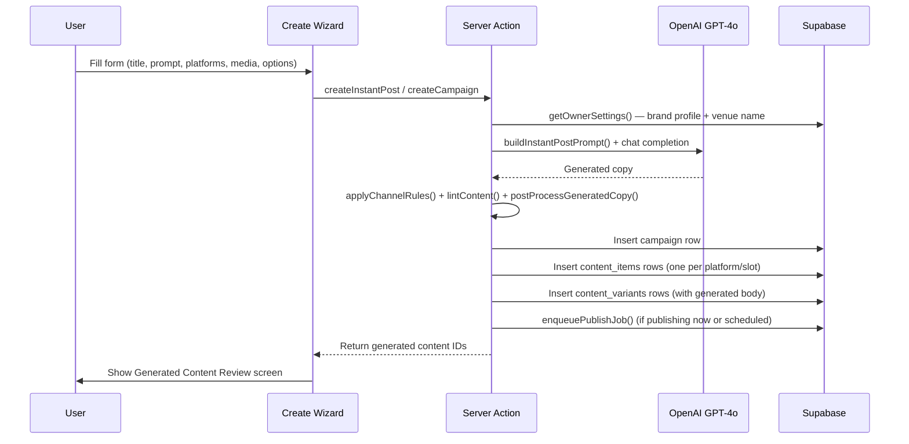

← [[_Index]] / [[_Features MOC]]

# Content Creation & Campaigns

## Overview

The Create feature is the core of CheersAI. Users describe what they want to post, select platforms, optionally attach media, and the system generates AI-written copy using OpenAI GPT-4o. Content can be posted immediately, scheduled for later, or saved as a draft.

## Campaign Types

| Type | Schema | Description |
|------|--------|-------------|
| `instant` | `instantPostSchema` | Single post, one or more platforms, now or scheduled |
| `story_series` | `storySeriesSchema` | Multiple story posts, each with a date/time slot and one image |
| `event` | `eventCampaignSchema` | Event announcement with auto-scheduled posts at offsets before the event |
| `promotion` | `promotionCampaignSchema` | Promotion with start/end date and scheduled posts across the run |
| `weekly` | `weeklyCampaignSchema` | Recurring weekly posts for a fixed number of weeks ahead |

All campaign schemas are defined in `src/lib/create/schema.ts` using Zod.

## Content Creation Flow

## AI Prompt Construction (`src/lib/ai/prompts.ts`)

The system prompt establishes:
- **CheersAI persona**: Writing as a single-owner British pub team
- **First-person voice rules**: "we", "us", "our" — strict grammar enforcement
- **Venue name placement rules**: Name allowed only in opening hook, location reference, or sign-off
- **Tone profile**: Driven by brand's `toneFormal` and `tonePlayful` sliders

The user message includes:
- Campaign title and prompt
- Brand voice settings (key phrases, banned topics, banned phrases)
- Per-platform guidance (word limits, hashtag rules, CTA style, Instagram link-in-bio line)
- Media context (filenames if attached)
- Scheduling context (post date, event date, promotion dates)
- Few-shot examples in British English

Platform-specific rules:
- **Facebook**: Up to 120 words, optional hashtags, CTA, optional signature
- **Instagram**: Up to 80 words, no URLs, link-in-bio line if URL provided, optional hashtags, optional signature
- **GBP**: Under 150 words (hard 900 char limit), no hashtags, GBP CTA action, no exclamation-heavy language

## Post-Processing (`src/lib/ai/postprocess.ts` + `src/lib/ai/content-rules.ts`)

After generation, copy passes through:
1. `postProcessGeneratedCopy()` — trims, normalises whitespace
2. `applyChannelRules()` — platform-specific transformations
3. `lintContent()` — validation warnings (character limits, hashtag counts)

## Advanced Options

| Option | Values | Effect |
|--------|--------|--------|
| `toneAdjust` | default, more_formal, more_casual, more_serious, more_playful | Tone adjustment instruction in prompt |
| `lengthPreference` | standard, short, detailed | Length instruction in prompt |
| `includeHashtags` | boolean | Whether to include hashtags |
| `includeEmojis` | boolean | Whether to include emojis |
| `ctaStyle` | default, direct, urgent | CTA instruction in prompt |
| `placement` | feed, story | Feed post or Instagram/Facebook Story |

## Story Constraints

Stories require:
- Exactly one image (no video)
- Facebook or Instagram only (GBP does not support stories)
- No prompt required (copy is optional/minimal for stories)

## Media Attachment

Media assets come from the [[Media Library]]. Users can attach images or video. Media IDs are stored in `content_variants.media_ids`. Signed URLs are generated at display time (600-second TTL).

## Proof Points Feature

The schema supports a `proofPointMode` option (`off`, `auto`, `selected`) with `proofPointsSelected` (manually chosen) and `proofPointIntentTags`. This feeds into the prompt to include specific proof points in generated copy (e.g. "Award-winning Sunday roast", "Dog-friendly").

## Campaign List & Detail

- `src/app/(app)/campaigns/page.tsx` — lists all campaigns
- `src/app/(app)/campaigns/new/page.tsx` — campaign creation (uses create wizard)
- `src/app/(app)/campaigns/[id]/page.tsx` — campaign detail with content items

Server actions in `src/app/(app)/campaigns/actions.ts` and `src/app/(app)/campaigns/[id]/actions.ts`.
