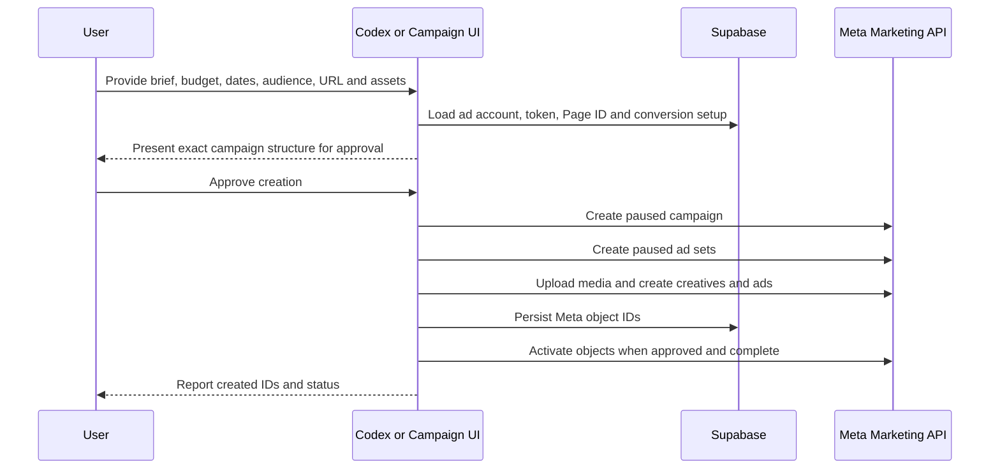

← [[_Index]] / [[_Features MOC]]

# Meta Paid Campaigns

## Existing Capability

CheersAI already connects directly to Meta's Marketing API. No extra MCP server, third-party connector, developer app, or new OAuth flow is required for one-off paid-ad work when the existing Meta connection is healthy.

The `/campaigns` workflow stores the connected ad account in `meta_ad_accounts` and uses `src/lib/meta/marketing.ts` to create and manage Meta objects. `src/app/(app)/campaigns/[id]/actions.ts` orchestrates publishing.

> [!NOTE] Codex One-off Campaigns
> Codex can use this existing application connection for paid campaigns that do not fit the `/campaigns` UI. Work directly with the user to collect the brief and assets, show the exact proposed campaign structure, budget, targeting, copy, destination, schedule, and initial status, then create it through the existing Meta Marketing API code only after explicit approval.

## Available Operations

| Operation | Existing implementation |
|---|---|
| Create campaign | `createMetaCampaign()` |
| Create ad set | `createMetaAdSet()` |
| Upload image | `uploadMetaImage()` |
| Create creative | `createMetaAdCreative()` |
| Create ad | `createMetaAd()` |
| Activate or pause | `setMetaObjectStatus()` / `pauseMetaObject()` |
| Read performance | `fetchMetaObjectInsights()` and `src/lib/campaigns/performance-sync.ts` |
| Search targeting | `searchMetaGeoLocations()` / `searchMetaInterests()` |

## Credentials and Account Data

- `meta_ad_accounts.access_token` supplies the Meta Marketing API token.
- `meta_ad_accounts.meta_account_id` supplies the advertising account ID.
- `meta_ad_accounts.token_expires_at` is checked before publishing.
- `social_connections.metadata.pageId` supplies the Facebook Page identity used by creatives.
- `meta_ad_accounts.meta_pixel_id` and the conversion settings support conversion-optimised campaigns.
- Server-side database access uses the configured Supabase URL and service-role key; secrets must never be printed, copied into documentation, or committed.

## Publish Flow

## Safety Rules

1. Confirm the ad account before any write.
2. Show the complete proposed spend, dates, targeting, placements, destination, and creative before creation.
3. Default one-off objects to `PAUSED` unless the user explicitly approves immediate activation.
4. Reuse the existing account token and Meta client; do not introduce a third-party ads connector without a separate decision.
5. Never reveal or log access tokens.
6. Persist Meta IDs so created objects can be traced, retried, paused, and measured.

## Required Brief

For a one-off campaign, collect: objective, total or daily budget, start/end dates, audience and location, destination URL, primary text, headline, description, CTA, creative asset, and whether the approved campaign should remain paused or go live.

> [!WARNING]
> Having the integration code does not guarantee that a stored token is still valid. Check connection state, token expiry, ad-account access, Page ID, and any required pixel/conversion configuration before creating objects.
