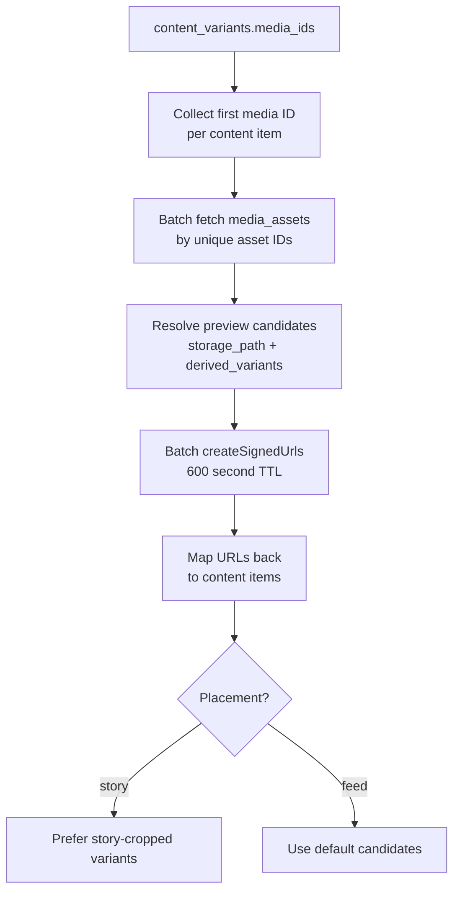

← [[_Index]] / [[_Features MOC]]

# Planner

## Overview

The Planner is the main workspace in CheersAI. It shows a calendar view of scheduled content, an activity feed of publish results and connection alerts, and a trash of soft-deleted items. Users can edit, approve, delete, schedule, or restore content from here.

## Data Loading

The planner loads via `getPlannerOverview()` in `src/lib/planner/data.ts`, which fires three parallel queries:

1. **Content items** (`includeItems=true`): `content_items` for a date range (default: next 7 days from now), joined with `campaigns(name)` and `content_variants(media_ids)`. Limited to 500 rows.
2. **Activity** (`includeActivity=true`): `notifications` for the account, unread only by default, limited to 6 entries.
3. **Trash** (`includeTrash=true`): soft-deleted `content_items` (`deleted_at IS NOT NULL`), limited to 20, includes body preview.

After content is loaded, a second batch query fetches signed media preview URLs for any content with `media_ids`.

## Media Preview Strategy

## Content Statuses

| Status | Description |
|--------|-------------|
| `draft` | Created, not yet approved or scheduled |
| `scheduled` | Approved and waiting for publish time |
| `queued` | `publish_jobs` row inserted, ready for Edge Function |
| `publishing` | Edge Function is actively publishing |
| `posted` | Successfully published to platform |
| `failed` | Publish failed (see `publish_jobs.last_error`) |

## Activity Feed

The activity feed shows `notifications` rows. The `category` field maps to display level:

| Category | Level |
|----------|-------|
| `publish_failed`, `story_publish_failed`, `connection_needs_action` | error |
| `publish_retry`, `story_publish_retry`, `connection_metadata_updated`, `connection_reconnected` | warning |
| Others (or null) | info |

Unread notifications are shown by default. The planner/notifications page shows all notifications without the unread filter.

## Content Detail (`/planner/[contentId]`)

Loads full content detail via `getPlannerContentDetail()`:
- Full `content_variants.body` (the copy)
- All `media_ids` with signed preview URLs
- Campaign association
- Latest `publish_jobs` entry (for last error and publish timestamp)
- `prompt_context` (the generation context, useful for re-generation)

Users can edit the body, swap media, reschedule, approve for publishing, or delete (soft delete sets `deleted_at`).

## Components

| Component | File | Purpose |
|-----------|------|---------|
| `PlannerCalendar` | `src/features/planner/planner-calendar.tsx` | Calendar grid with content items |
| `PlannerContentComposer` | `src/features/planner/planner-content-composer.tsx` | Content editing form |
| `PlannerStatusFilters` | `src/features/planner/planner-status-filters.tsx` | Filter by content status |
| `PlannerViewToggle` | `src/features/planner/planner-view-toggle.tsx` | Calendar vs list view toggle |
| `ActivityFeed` | `src/features/planner/activity-feed.tsx` | Notification feed |
| `ApproveDraftButton` | `src/features/planner/approve-draft-button.tsx` | Approve draft → scheduled |
| `DeleteContentButton` | `src/features/planner/delete-content-button.tsx` | Soft-delete |
| `RestoreContentButton` | `src/features/planner/restore-content-button.tsx` | Restore from trash |
