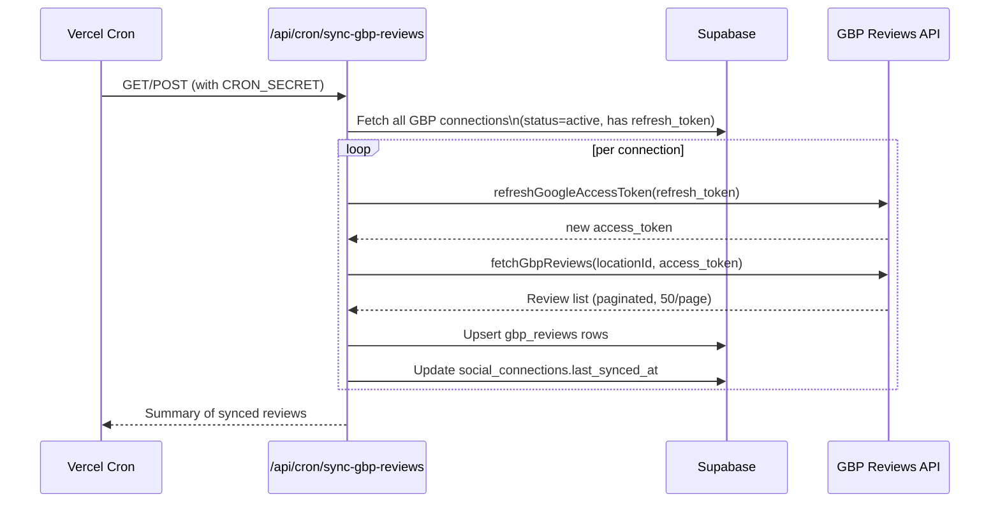

← [[_Index]] / [[_Features MOC]]

# Reviews (Google Business Profile)

## Overview

The Reviews feature displays Google Business Profile reviews and allows replying to them directly from CheersAI. Reviews are synced periodically via a cron job and cached in the database.

## Data Source

Reviews come from the **Google My Business Reviews API** (not the deprecated v4 `mybusiness` API):
```
https://mybusinessreviews.googleapis.com/v1/{locationId}/reviews
```

The caller must pass a **canonical** location ID — `locations/{numericId}`. Non-canonical IDs (e.g. `locations/ChIJ...`) are rejected by the API.

## Sync Process (`/api/cron/sync-gbp-reviews`)



## Rate Limiting

The GBP API enforces strict rate limits. The code handles this via `GbpRateLimitError`:

- `parseRetryAfter()` extracts the `Retry-After` header from 429 responses
- The UI surfaces the rate limit countdown (e.g. "Rate limited — retry in 4m 30s")
- The cron job records the rate limit details in `social_connections.metadata.rateLimitedUntil`
- The sync skips connections that are still within their rate limit window

> [!WARNING] Rate Limit Loop
> Non-canonical location IDs cause persistent rate-limit loops. The GBP API rejects invalid IDs with a 429-like error, and the sync repeatedly fails. The fix (commits 07f2dd1 and 97a078a) is to always normalise to canonical `locations/{numericId}` format and persist it to the database so the cron never tries non-canonical IDs again.

## Review Data Model (`gbp_reviews` table)

| Column | Source |
|--------|--------|
| `business_profile_id` | The `social_connections` account ID |
| `google_review_id` | `review.reviewId` from API |
| `reviewer_name` | `review.reviewer.displayName` |
| `star_rating` | Converted from `ONE/TWO/.../FIVE` to integer 1–5 |
| `comment` | `review.comment` (nullable — rating-only reviews have no comment) |
| `create_time` | `review.createTime` |
| `update_time` | `review.updateTime` |
| `reply_comment` | `review.reviewReply.comment` |
| `reply_update_time` | `review.reviewReply.updateTime` |
| `status` | `replied` or `pending` |
| `synced_at` | When this row was last upserted |

## Replying to Reviews

`postGbpReply()` in `src/lib/gbp/reviews.ts` sends a PUT request to:
```
https://mybusinessreviews.googleapis.com/v1/{reviewName}/reply
```

Where `reviewName` is the full resource path `locations/{id}/reviews/{reviewId}`.

### AI Draft Generation

`generateAiDraft()` in `src/app/(app)/reviews/actions.ts` uses OpenAI to suggest a reply. As of 2026-03-14, the system prompt is **dynamic** — it reads `getOwnerSettings()` to pull:

- **Venue name** — addressed as the business in first-person plural ("we/us/our")
- **Tone sliders** — `toneFormal` and `tonePlayful` from `brand_profile` (0–10 scale)
- **Banned phrases** — excluded from the generated reply
- **Key phrases** — encouraged for inclusion

If `getOwnerSettings()` fails, the function falls back to a neutral British-English prompt. The prompt always instructs British English and first-person plural voice.

> [!NOTE]
> Previously (before 2026-03-14) the system prompt was hardcoded to reference "The Anchor" specifically. It is now fully multi-tenant.

## UI Components

| Component | File | Purpose |
|-----------|------|---------|
| `ReviewsList` | `src/features/reviews/ReviewsList.tsx` | Paginated list of reviews with reply UI |
| `ReviewCard` | `src/features/reviews/ReviewCard.tsx` | Individual review card with star rating |
