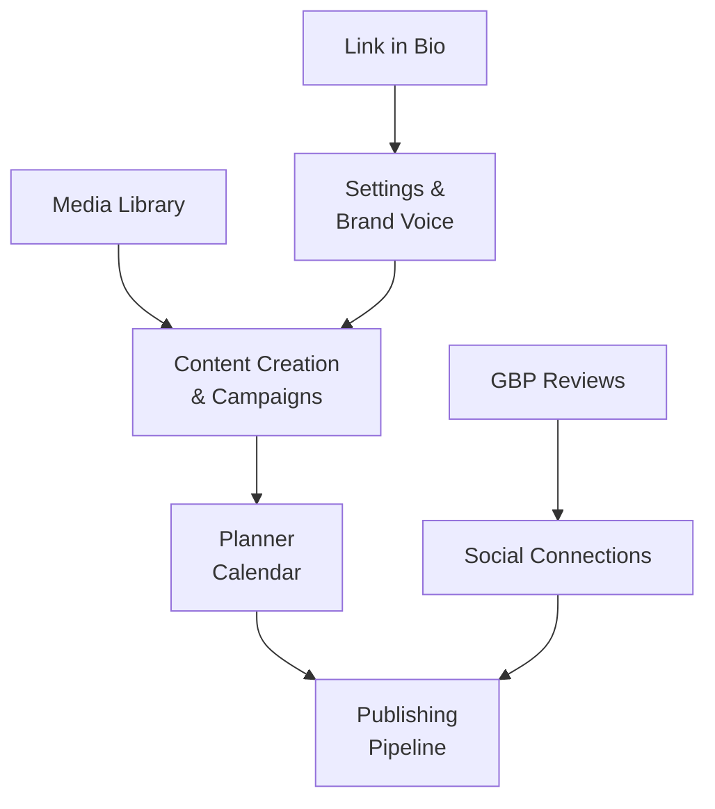

← [[_Index]]

# Features

Feature-by-feature documentation of CheersAI 2.0.



## Documents

```dataview
TABLE status, last_updated
FROM "Obsidian/OJ-CheersAI2.0/Features"
WHERE file.name != "_Features MOC"
SORT file.name ASC
```

## Related

- [[_Architecture MOC]]
- [[_API MOC]]
- [[_Business Rules MOC]]
