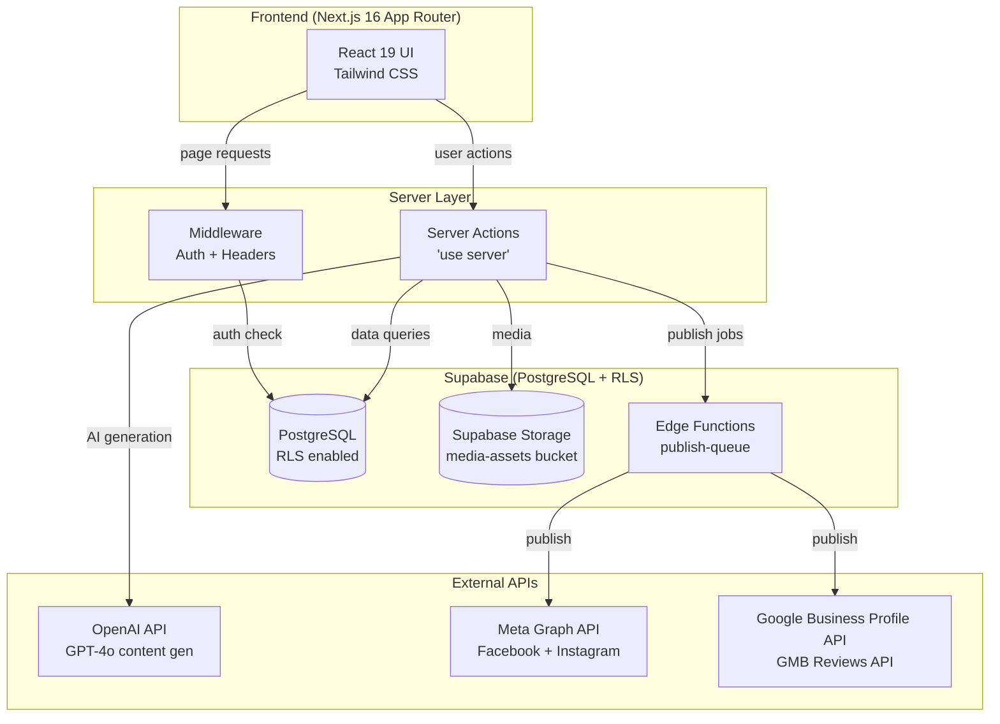

# CheersAI 2.0

> AI-powered social media content platform for independent British pub operators — generates, schedules, and publishes content to Facebook, Instagram, and Google Business Profile.

## Sections

| Section | Description |
|---------|-------------|
| [[_Architecture MOC]] | Stack, data flow, routes, auth & security |
| [[_Features MOC]] | Feature-by-feature documentation |
| [[_Database MOC]] | Schema, RLS policies, migrations |
| [[_API MOC]] | Server actions, route handlers, external integrations |
| [[_Components MOC]] | UI component catalog |
| [[_Business Rules MOC]] | Domain rules and policies |
| [[_Health MOC]] | Optimization opportunities and tech debt |

## Recently Updated

- 2026-05-02 (17:30) - Story-series same-day scheduling now stays on the selected date after the 07:00 slot has passed
- 2026-03-14 (12:00) — Streaming AI generation, content templates, expiry emails, signed URL caching
- 2026-03-14 (10:30) — Notifications DB index added, AI review brand voice wired up, publish failure emails implemented
- 2026-03-14 (09:00) — Initial vault created from full codebase scan

## Health Summary

| Area | Open | Resolved |
|------|------|---------|
| Optimization Opportunities | 5 open | 1 resolved (notifications index) |
| Tech Debt | 6 open (TD-006 partially resolved) | — |

See [[Optimization Opportunities]] and [[Tech Debt]] for details.

## Key Facts

- **Stack**: Next.js 16.1, React 19.2, TypeScript strict, Tailwind CSS, Supabase, Vercel
- **Platforms**: Facebook Pages, Instagram Business, Google Business Profile
- **AI**: OpenAI GPT-4o for content generation with CheersAI persona
- **Target user**: Single-owner British pub operators
- **Timezone**: Always Europe/London (hardcoded default)
- **Last sync**: 2026-05-02
