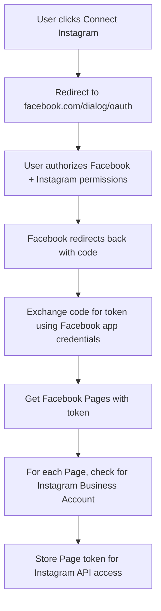

# Instagram Integration Guide for CheersAI

## Overview

This comprehensive guide covers the complete Instagram integration for CheersAI, including technical analysis, implementation status, troubleshooting, and future requirements. Instagram integration was fundamentally rebuilt in January 2025 due to the deprecation of Instagram Basic Display API.

## Executive Summary

The Instagram integration was completely rewritten following the December 4, 2024 deprecation of Instagram Basic Display API. The new implementation uses Facebook OAuth with Instagram Graph API permissions, providing more stable and feature-rich integration for Instagram Business accounts.

## Historical Context & Migration

### What Changed (December 2024)
- **Instagram Basic Display API**: Deprecated and shut down
- **Direct Instagram OAuth**: No longer supported for business use
- **Separate Instagram Apps**: No longer recommended approach

### Migration to Facebook OAuth
The integration was migrated from direct Instagram OAuth to Facebook OAuth for the following reasons:
1. Instagram Business API requires Facebook OAuth
2. More stable token management through Facebook Pages
3. Single OAuth flow for both Facebook and Instagram
4. Access to advanced Instagram Business features

## Technical Architecture

### Current Implementation Flow



### Database Schema

```sql
-- Instagram connections are stored in social_connections table
CREATE TABLE social_connections (
  id UUID PRIMARY KEY DEFAULT uuid_generate_v4(),
  tenant_id UUID REFERENCES tenants(id) ON DELETE CASCADE,
  platform VARCHAR(50) NOT NULL, -- 'instagram_business'
  account_id TEXT,               -- Instagram Business Account ID
  account_name TEXT,             -- Instagram username
  page_id TEXT,                  -- Associated Facebook Page ID
  page_name TEXT,                -- Facebook Page name
  access_token TEXT,             -- Facebook PAGE access token (not user token)
  token_expires_at TIMESTAMPTZ,  -- Token expiry date
  metadata JSONB,                -- Profile picture, follower count, etc.
  is_active BOOLEAN DEFAULT true,
  created_at TIMESTAMPTZ DEFAULT NOW(),
  updated_at TIMESTAMPTZ DEFAULT NOW()
);
```

### API Endpoints

#### OAuth Initiation
**Endpoint**: `/api/social/connect`
**Method**: POST
**Body**: `{ "platform": "instagram_business" }`

Uses Facebook OAuth URL:
```javascript
const authUrl = `https://www.facebook.com/v23.0/dialog/oauth?` +
  `client_id=${FACEBOOK_APP_ID}&` +
  `redirect_uri=${redirectUri}&` +
  `scope=email,public_profile,pages_show_list,pages_read_engagement,instagram_basic,instagram_content_publish,instagram_manage_comments,instagram_manage_insights&` +
  `state=${encodedState}`;
```

#### OAuth Callback
**Endpoint**: `/api/social/callback`
**Method**: GET

Process:
1. Exchange authorization code for access token
2. Convert to long-lived token (~60 days)
3. Get user's Facebook Pages
4. Check each page for Instagram Business Account
5. Store connections with Page access tokens

### Publishing API

```javascript
// Publishing to Instagram
export async function publishToInstagram(
  igUserId: string,
  pageAccessToken: string,
  imageUrl: string,
  caption: string
) {
  // Step 1: Create media container
  const createResponse = await fetch(
    `https://graph.facebook.com/v23.0/${igUserId}/media`,
    {
      method: "POST",
      headers: { "Content-Type": "application/json" },
      body: JSON.stringify({
        image_url: imageUrl,
        caption: caption,
        access_token: pageAccessToken,
      }),
    }
  );
  
  const { id } = await createResponse.json();
  
  // Step 2: Publish the container
  const publishResponse = await fetch(
    `https://graph.facebook.com/v23.0/${igUserId}/media_publish`,
    {
      method: "POST",
      headers: { "Content-Type": "application/json" },
      body: JSON.stringify({
        creation_id: id,
        access_token: pageAccessToken,
      }),
    }
  );
  
  return publishResponse.json();
}
```

## Implementation Status

### ✅ Completed Fixes

#### 1. Removed Broken Instagram OAuth Files
- ✅ Deleted `/app/api/auth/callback/instagram-business/route.ts`
- ✅ Deleted `/app/api/social/connect/instagram/route.ts`
- ✅ Deleted `/components/social/instagram-connect-button.tsx`

#### 2. Updated OAuth Flow to Use Facebook
- ✅ Modified `/app/api/social/connect/route.ts`:
  - Unified Facebook and Instagram to use same OAuth flow
  - Using Facebook OAuth URL: `facebook.com/v23.0/dialog/oauth`
  - Requesting correct scopes including `instagram_basic`, `instagram_content_publish`
  - Using Graph API v23.0 (current until May 29, 2025)

#### 3. Fixed Callback Handler
- ✅ Updated `/app/api/social/callback/route.ts`:
  - Exchanges code for short-lived token
  - Converts to long-lived token (~60 days)
  - Gets Facebook Pages with their tokens
  - Checks each page for Instagram Business Account
  - Stores Page access token (not user token) for Instagram API calls
  - Adds metadata storage for profile picture and follower count

#### 4. Database Updates
- ✅ Created migration `020_instagram_fix.sql`:
  - Adds metadata JSONB column for Instagram-specific data
  - Marks existing Instagram connections as inactive
  - Documents proper token usage in column comments

#### 5. Environment Variables Cleanup
- ✅ Removed deprecated Instagram app credentials
- ✅ Updated documentation to reflect Facebook OAuth usage
- ✅ Added comments explaining new flow

#### 6. Instagram Publishing Code Updates
- ✅ Updated `/lib/social/instagram.ts`:
  - Changed all API calls to v23.0
  - Updated to use `social_connections` table
  - Fixed to look for `instagram_business` platform
  - Uses `account_id` field for Instagram Business Account ID

#### 7. UI Component Updates
- ✅ Updated `/components/quick-post-modal.tsx`:
  - Fixed platform detection for `instagram_business`
  - Updated display name to show "Instagram Business"
  - Corrected icon styling for Instagram connections

### Database Migration Applied

#### Migration 021: Hotfix for RLS Policies
**Issue**: RLS policies referenced dropped function `get_user_tenant_id()`
**Solution**: Created compatibility shim function to restore functionality

```sql
-- Temporary compatibility function
CREATE OR REPLACE FUNCTION get_user_tenant_id()
RETURNS UUID
LANGUAGE plpgsql
SECURITY DEFINER
AS $$
BEGIN
  RETURN (
    SELECT tenant_id 
    FROM users 
    WHERE id = auth.uid()
  );
END;
$$;
```

#### Migration 022: Permanent RLS Fix
**Solution**: Updated all social_connections policies to use `get_auth_tenant_id()`

```sql
-- Fixed RLS policies
DROP POLICY IF EXISTS "Users can manage own social connections" ON social_connections;
CREATE POLICY "Users can manage own social connections" ON social_connections
  FOR ALL TO authenticated
  USING (tenant_id = get_auth_tenant_id());
```

## Configuration Requirements

### Facebook App Configuration

#### Required Products
1. **Facebook Login** (standard, not "for Business")
2. **Instagram Graph API**

#### OAuth Settings
```
Valid OAuth Redirect URIs:
- https://cheersai.orangejelly.co.uk/api/social/callback

Settings:
- Client OAuth Login: ON
- Web OAuth Login: ON  
- Enforce HTTPS: ON
```

#### Required Permissions (App Review)
- `email` - User identification
- `public_profile` - Basic user info
- `pages_show_list` - Access Facebook Pages
- `pages_read_engagement` - Read Page data
- `instagram_basic` - Read Instagram account info
- `instagram_content_publish` - Publish to Instagram
- `instagram_manage_comments` - Manage Instagram comments
- `instagram_manage_insights` - Access Instagram analytics

### Environment Variables

```env
# Facebook App Credentials (used for Instagram)
NEXT_PUBLIC_FACEBOOK_APP_ID=1001401138674450
FACEBOOK_APP_SECRET=your_rotated_secret_here

# Instagram-specific variables (REMOVED - no longer needed)
# INSTAGRAM_APP_ID=1138649858083556  # DEPRECATED
# INSTAGRAM_APP_SECRET=...           # DEPRECATED
# INSTAGRAM_VERIFY_TOKEN=...         # DEPRECATED
```

## Troubleshooting Guide

### Common Issues

#### Issue 1: "Error validating application"
**Symptoms**: OAuth flow fails with application validation error
**Causes**:
1. Using deprecated Instagram app credentials
2. App in Development mode
3. Missing environment variables

**Solutions**:
1. Ensure using Facebook app credentials only
2. Switch app to Live mode or add user as tester
3. Verify `FACEBOOK_APP_SECRET` is set in production

#### Issue 2: "storage_failed" Error
**Symptoms**: OAuth completes but connection not saved
**Cause**: RLS policies blocking database writes
**Solution**: Apply migrations 021 and 022 to fix RLS policies

#### Issue 3: "No Instagram Business Account found"
**Symptoms**: Facebook login works but no Instagram account
**Causes**:
1. Instagram account not connected to Facebook Page
2. Instagram account not Business/Creator type
3. Missing Instagram permissions

**Solutions**:
1. Convert Instagram to Business account
2. Connect to Facebook Page
3. Ensure all Instagram permissions granted during OAuth

#### Issue 4: Publishing fails with "Invalid token"
**Symptoms**: Connection exists but posting fails
**Causes**:
1. Using user token instead of page token
2. Token expired (60 days)
3. Missing publishing permissions

**Solutions**:
1. Verify using page access token for API calls
2. Implement token refresh mechanism
3. Check permissions granted during OAuth

### Debugging Tools

#### Debug Endpoint
Visit: `https://cheersai.orangejelly.co.uk/api/debug-oauth`

Provides:
- Current environment configuration
- Redirect URI validation
- App credential status
- OAuth flow verification

#### SQL Debugging Queries

```sql
-- Check RLS policies
SELECT policyname, qual, with_check
FROM pg_policies 
WHERE tablename = 'social_connections';

-- Test auth function
SELECT get_auth_tenant_id();

-- Check recent connections
SELECT * FROM social_connections 
WHERE platform = 'instagram_business' 
ORDER BY created_at DESC 
LIMIT 5;

-- Verify token expiry
SELECT account_name, token_expires_at, 
       (token_expires_at < NOW()) AS expired
FROM social_connections 
WHERE platform = 'instagram_business';
```

## Security Considerations

### Token Management
1. **Page Tokens**: Store Facebook Page tokens, not user tokens
2. **Expiry Tracking**: Tokens expire after ~60 days
3. **Refresh Mechanism**: Implement automatic token refresh
4. **Encryption**: Store tokens encrypted at rest

### Authentication Security
1. **Session Validation**: Verify user session during OAuth callback
2. **Tenant Isolation**: Ensure connections are tenant-scoped
3. **State Parameter**: Use signed state parameter to prevent CSRF
4. **HTTPS Only**: All OAuth flows must use HTTPS

### Data Privacy
1. **Minimal Data**: Only store necessary account information
2. **User Consent**: Clear permissions during OAuth flow
3. **Data Deletion**: Implement account disconnection
4. **Audit Trail**: Log all connection events

## Future Enhancements

### Token Refresh System
```javascript
// Implement token refresh cron job
export async function refreshExpiredTokens() {
  const expiringConnections = await getExpiringTokens();
  
  for (const connection of expiringConnections) {
    try {
      const newToken = await refreshPageToken(connection.access_token);
      await updateConnectionToken(connection.id, newToken);
    } catch (error) {
      await notifyUserTokenExpired(connection.tenant_id, connection.account_name);
    }
  }
}
```

### Enhanced Error Handling
1. **Retry Logic**: Automatic retry for temporary failures
2. **User Notifications**: Alert users of connection issues
3. **Graceful Degradation**: Handle partial failures
4. **Detailed Logging**: Track all API interactions

### Advanced Features
1. **Instagram Stories**: Support for story publishing
2. **Instagram Reels**: Video content publishing
3. **Advanced Analytics**: Detailed performance metrics
4. **Bulk Operations**: Multi-account management

## Migration Guide for Existing Users

### User Impact
- Existing Instagram connections marked as inactive
- Users must reconnect Instagram through Facebook
- Instagram Business Account must be linked to Facebook Page
- Personal Instagram accounts cannot be connected

### Migration Steps for Users
1. **Preparation**:
   - Convert Instagram to Business account
   - Create/connect Facebook Page
   - Ensure admin access to both accounts

2. **Reconnection**:
   - Visit Settings → Social Connections
   - Click "Connect Instagram"
   - Grant Facebook and Instagram permissions
   - Verify connection successful

3. **Testing**:
   - Create test post
   - Verify posting works
   - Check analytics access

## API Reference

### Instagram Graph API Endpoints Used

#### Account Information
```
GET https://graph.facebook.com/v23.0/{ig-user-id}?fields=username,profile_picture_url,followers_count&access_token={page-token}
```

#### Publishing
```
POST https://graph.facebook.com/v23.0/{ig-user-id}/media
{
  "image_url": "...",
  "caption": "...",
  "access_token": "{page-token}"
}
```

#### Analytics
```
GET https://graph.facebook.com/v23.0/{ig-user-id}/insights?metric=impressions,reach,profile_views&period=day&access_token={page-token}
```

### Rate Limits
- **Publishing**: 25 posts per day per Instagram account
- **Analytics**: 200 requests per hour per app
- **General API**: As per Facebook Graph API limits

## Testing Strategy

### Local Testing
1. Update environment variables (remove Instagram app credentials)
2. Test Facebook OAuth flow
3. Verify Instagram accounts discovered from Pages
4. Check Page access tokens stored correctly
5. Test posting to Instagram

### Production Testing
1. Deploy environment variable changes
2. Run database migrations
3. Rotate Facebook app secret
4. Test with admin Facebook account
5. Monitor error logs for OAuth failures

### Test Checklist
- [ ] Remove all Instagram environment variables
- [ ] Test Facebook OAuth flow
- [ ] Verify Instagram accounts are discovered from Pages
- [ ] Check Page access tokens are stored correctly
- [ ] Test posting to Instagram
- [ ] Verify token expiry handling
- [ ] Test different tenant isolation
- [ ] Check error handling and logging

## Success Metrics

- ✅ No more "Error validating application" errors
- ✅ Users can connect Instagram via Facebook OAuth
- ✅ Instagram posts publish successfully
- ✅ Page access tokens stored and used correctly
- ✅ Token expiry dates tracked
- ✅ No exposed secrets in codebase
- ✅ RLS policies properly isolate tenant data
- ✅ Detailed errors logged for debugging

## Documentation & Resources

### Official Documentation
- [Instagram Business API](https://developers.facebook.com/docs/instagram-api)
- [Facebook OAuth Flow](https://developers.facebook.com/docs/facebook-login/guides/advanced/manual-flow)
- [Graph API v23.0 Changelog](https://developers.facebook.com/docs/graph-api/changelog/version23.0)

### Debugging Tools
- [Graph API Explorer](https://developers.facebook.com/tools/explorer/)
- [Access Token Debugger](https://developers.facebook.com/tools/debug/accesstoken/)
- [Facebook App Settings](https://developers.facebook.com/apps/1001401138674450/)

### Support
- **Technical Contact**: peter@orangejelly.co.uk
- **Response Time**: Within 24 hours
- **Business Hours**: 9 AM - 6 PM GMT

## Appendix: Key Changes Summary

### Before (Broken Implementation)
- Direct Instagram OAuth: `instagram.com/oauth/authorize`
- Instagram App ID: 1138649858083556
- Invalid scopes: `instagram_business_*`
- User access token storage
- Mixed API endpoints

### After (Fixed Implementation)
- Facebook OAuth: `facebook.com/v23.0/dialog/oauth`
- Facebook App ID: 1001401138674450
- Valid scopes: `instagram_basic`, `instagram_content_publish`
- Page access token storage
- Facebook Graph API v23.0 only

### Database Changes
- Added `metadata` JSONB column for profile data
- Platform value: `instagram_business`
- Stores Page ID and Page name for Instagram connections
- Token expiry tracking in `token_expires_at`
- Fixed RLS policies using `get_auth_tenant_id()`

---

*This document represents the complete Instagram integration guide following the January 2025 rewrite. The implementation is production-ready and follows Meta's current API requirements.*